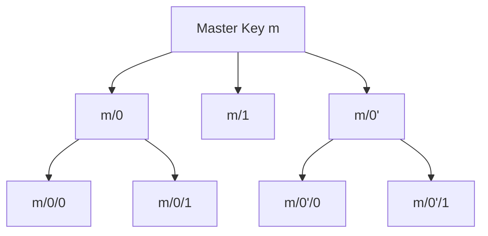

# Key Derivation

BIP32 defines a tree structure of keys derived from a single master key. Each key can derive child keys using an index number, and keys can be derived along a path of indices.

## Derivation Model



---

## derive

Derive a child key by index. Indices >= 0x80000000 produce hardened keys.

```typescript
derive(index: number): BIP32Interface
```

| Parameter | Type | Description |
|-----------|------|-------------|
| `index` | `number` | Child index (UInt32: 0 to 4,294,967,295) |

```typescript
const child0 = master.derive(0);        // Normal child at index 0
const child1 = master.derive(1);        // Normal child at index 1
const hardened = master.derive(0x80000000); // Hardened child at index 0
```

### Normal vs Hardened Derivation

| | Normal | Hardened |
|---|--------|---------|
| Index range | 0 – 2,147,483,647 | 2,147,483,648 – 4,294,967,295 |
| Requires private key | No | Yes |
| Public-only derivation | Supported | Not supported |
| Notation | `m/0` | `m/0'` |

Normal derivation uses the parent public key, so a neutered (public-only) key can derive normal children. Hardened derivation uses the parent private key, preventing public-only derivation.

```typescript
const neutered = master.neutered();
const child = neutered.derive(0);  // Works (normal)

try {
  neutered.derive(0x80000000);  // Throws: Missing private key for hardened child key
} catch (e) {
  console.error(e.message);
}
```

---

## deriveHardened

Convenience method to derive a hardened child. Adds 0x80000000 to the index internally.

```typescript
deriveHardened(index: number): BIP32Interface
```

| Parameter | Type | Description |
|-----------|------|-------------|
| `index` | `number` | Child index (UInt31: 0 to 2,147,483,647) |

```typescript
const hardened0 = master.deriveHardened(0);  // Same as master.derive(0x80000000)
const hardened1 = master.deriveHardened(1);  // Same as master.derive(0x80000001)
```

---

## derivePath

Derive a key along a full BIP32 path string.

```typescript
derivePath(path: string): BIP32Interface
```

| Parameter | Type | Description |
|-----------|------|-------------|
| `path` | `string` | BIP32 path (e.g. `"m/44'/0'/0'/0/0"`) |

```typescript
const child = master.derivePath("m/44'/0'/0'/0/0");
```

### Path Format

- Must match the pattern `^(m\/)?(\d+'?\/)*\d+'?$`
- `m/` prefix is optional but if present, the key must be a master key (depth 0)
- `'` suffix denotes hardened derivation
- Examples: `"m/44'/0'/0'/0/0"`, `"0'/1/2'/2/1000000000"`, `"44'/0'/0'"``

### Standard Paths

| BIP | Path | Address Type |
|-----|------|-------------|
| BIP44 | `m/44'/0'/0'/0/0` | Legacy P2PKH (1...) |
| BIP49 | `m/49'/0'/0'/0/0` | SegWit P2SH-P2WPKH (3...) |
| BIP84 | `m/84'/0'/0'/0/0` | Native SegWit P2WPKH (bc1q...) |
| BIP86 | `m/86'/0'/0'/0/0` | Taproot P2TR (bc1p...) |
| BIP360 | `m/360'/0'/0'/0/0` | Post-Quantum |

---

## Key Properties After Derivation

Each derived key carries its position in the tree:

```typescript
const child = master.derivePath("m/44'/0'/0'");

console.log(child.depth);             // 3
console.log(child.index);             // 2147483648 (0x80000000 = hardened 0)
console.log(child.parentFingerprint); // Parent's fingerprint (4 bytes as uint32)

// Identifier is hash160(publicKey)
console.log(toHex(child.identifier));

// Fingerprint is first 4 bytes of identifier
console.log(toHex(child.fingerprint));
```

---

[← Previous: Factory & Key Creation](./factory.md) | [Next: Serialization →](./serialization.md)
