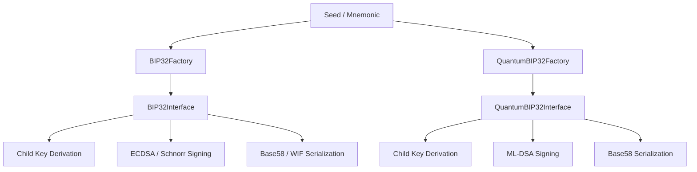

# Overview

`@btc-vision/bip32` implements the BIP32 standard for hierarchical deterministic (HD) wallets, enabling deterministic key derivation from a single seed. It also provides a quantum-resistant variant using ML-DSA (FIPS 204) for post-quantum security.

## Features

- **BIP32 HD Wallets** — Derive an entire tree of keys from a single seed
- **Quantum-Resistant Keys** — ML-DSA (Dilithium) support at three security levels
- **ECDSA & Schnorr Signing** — Sign and verify with both signature schemes
- **Taproot Tweaking** — Key tweaking for Taproot (BIP86) compatibility
- **Standard Derivation Paths** — Built-in BIP44, BIP49, BIP84, BIP86, and BIP360 paths
- **Multi-Network** — Bitcoin mainnet, testnet, and regtest configurations
- **Dual Module** — Ships both ESM and CJS builds

## Architecture

## Classical vs Quantum

| Feature | Classical (BIP32) | Quantum (ML-DSA) |
|---------|-------------------|-------------------|
| Key type | secp256k1 ECDSA | ML-DSA lattice |
| Public key size | 33 bytes | 1,312–2,592 bytes |
| Private key size | 32 bytes | 2,560–4,896 bytes |
| Signature size | ~72 bytes | 2,420–4,627 bytes |
| Public derivation | Supported | Not supported |
| Security model | Classical | Post-quantum |
| ECC library required | Yes | No |

---

[← Back to Index](../README.md) | [Next: Installation →](./installation.md)
