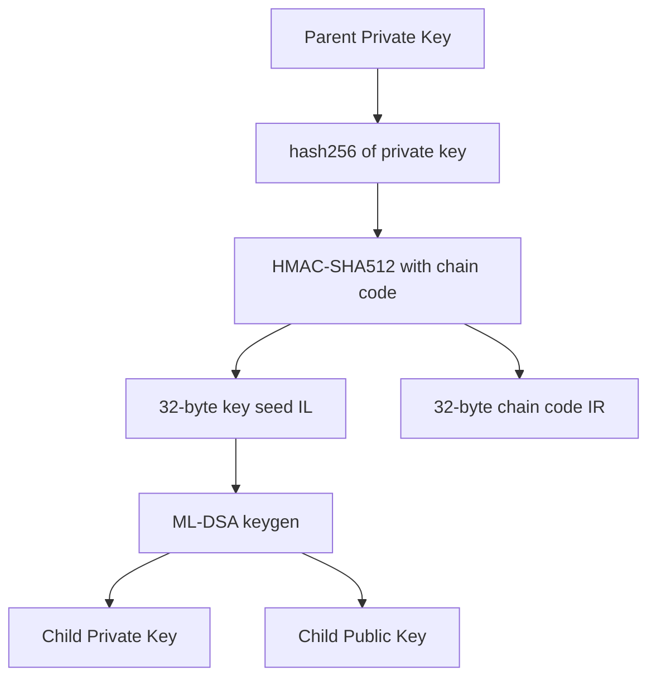

# Quantum Key Derivation

Quantum BIP32 uses HMAC-SHA512 for hierarchical seed derivation, then ML-DSA for key generation at each level.

## Derivation Model



Unlike classical BIP32 where normal derivation uses the public key, quantum derivation **always requires the private key**. This is because ML-DSA does not support additive public key derivation.

---

## derive

Derive a child key by index.

```typescript
derive(index: number): QuantumBIP32Interface
```

| Parameter | Type | Description |
|-----------|------|-------------|
| `index` | `number` | Child index (UInt32) |

```typescript
const child = master.derive(0);
const hardened = master.derive(0x80000000);
```

Both normal and hardened derivation require the private key. Calling `derive` on a neutered key throws.

### Normal vs Hardened

| | Normal | Hardened |
|---|--------|---------|
| Index range | 0 – 2,147,483,647 | 2,147,483,648 – 4,294,967,295 |
| Requires private key | **Yes** | Yes |
| Derivation data | hash256(privateKey) + index | 0x00 + hash256(privateKey) + index |

---

## deriveHardened

Convenience method for hardened derivation.

```typescript
deriveHardened(index: number): QuantumBIP32Interface
```

| Parameter | Type | Description |
|-----------|------|-------------|
| `index` | `number` | Child index (UInt31: 0 to 2,147,483,647) |

```typescript
const hardened = master.deriveHardened(0); // Same as master.derive(0x80000000)
```

---

## derivePath

Derive along a full BIP32 path.

```typescript
derivePath(path: string): QuantumBIP32Interface
```

| Parameter | Type | Description |
|-----------|------|-------------|
| `path` | `string` | BIP32 path string |

```typescript
// Standard quantum path
const child = master.derivePath("m/360'/0'/0'/0/0");
```

Path validation is identical to classical BIP32.

---

## Signing & Verification

Quantum keys use ML-DSA for signing. Signatures include extra entropy for enhanced security.

```typescript
// Sign
const hash = new Uint8Array(32).fill(0x01);
const signature = node.sign(hash);

// Verify
const valid = node.verify(hash, signature);
```

---

## Serialization

```typescript
// To Base58
const encoded = node.toBase58();

// From Base58 (auto-detects network and security level)
const restored = QuantumBIP32Factory.fromBase58(encoded);
```

The Base58 format for quantum keys is variable-length, with the key data size depending on the security level:

| Offset | Size | Field |
|--------|------|-------|
| 0 | 4 bytes | Version bytes |
| 4 | 1 byte | Depth |
| 5 | 4 bytes | Parent fingerprint |
| 9 | 4 bytes | Child index |
| 13 | 32 bytes | Chain code |
| 45 | Variable | Key data (private or public key) |

---

## Neutering

```typescript
const neutered = node.neutered();
console.log(neutered.isNeutered());  // true
console.log(neutered.privateKey);    // undefined

// Neutered quantum keys CANNOT derive children
try {
  neutered.derive(0);
} catch (e) {
  // "Cannot derive child keys without private key"
}
```

---

## Properties

```typescript
node.publicKey;          // Uint8Array — ML-DSA public key
node.privateKey;         // Uint8Array | undefined
node.chainCode;          // Uint8Array — 32-byte chain code
node.depth;              // number
node.index;              // number
node.parentFingerprint;  // number
node.identifier;         // Uint8Array — hash160(publicKey)
node.fingerprint;        // Uint8Array — first 4 bytes of identifier
node.securityLevel;      // MLDSASecurityLevel
node.network;            // Network
```

---

[← Previous: Quantum Factory](./factory.md) | [Next: Networks →](../networks/network-configuration.md)
