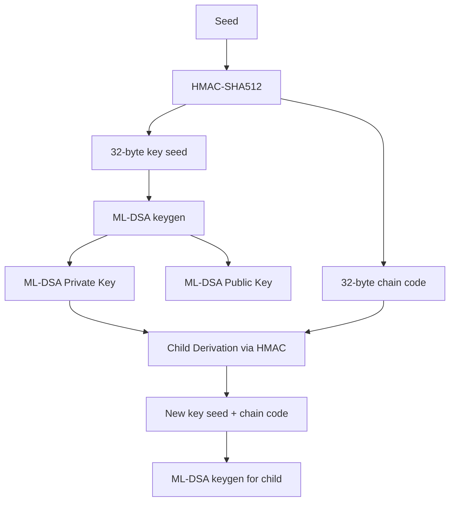

# Quantum-Resistant BIP32

`@btc-vision/bip32` includes a quantum-resistant variant of BIP32 using ML-DSA (Module-Lattice Digital Signature Algorithm, FIPS 204), also known as CRYSTALS-Dilithium.

## Why Quantum Resistance

Classical ECDSA keys on secp256k1 are vulnerable to quantum attacks via Shor's algorithm. ML-DSA is a NIST-standardized post-quantum signature scheme based on lattice cryptography, resistant to both classical and quantum computers.

## How It Works

The quantum BIP32 implementation follows the same hierarchical pattern as classical BIP32:

1. A seed is processed through HMAC-SHA512 to produce key material and a chain code
2. The key material is used as input to ML-DSA key generation
3. Child keys are derived using HMAC-SHA512 on the chain code and parent key data
4. Each child's HMAC output feeds into a new ML-DSA key generation

## Key Differences from Classical BIP32

- **No public-only derivation** — ML-DSA does not support additive key derivation like ECDSA. Both normal and hardened derivation require the private key.
- **No ECC library needed** — ML-DSA is built into the library via `@btc-vision/post-quantum`
- **Singleton factory** — `QuantumBIP32Factory` is a pre-built object, not a factory function
- **Larger keys** — ML-DSA keys are significantly larger than ECDSA keys (see [Security Levels](./security-levels.md))
- **BIP360 path** — Uses `m/360'/...` derivation paths by convention

---

[← Previous: Key Tweaking](../bip32/tweaking.md) | [Next: Security Levels →](./security-levels.md)
