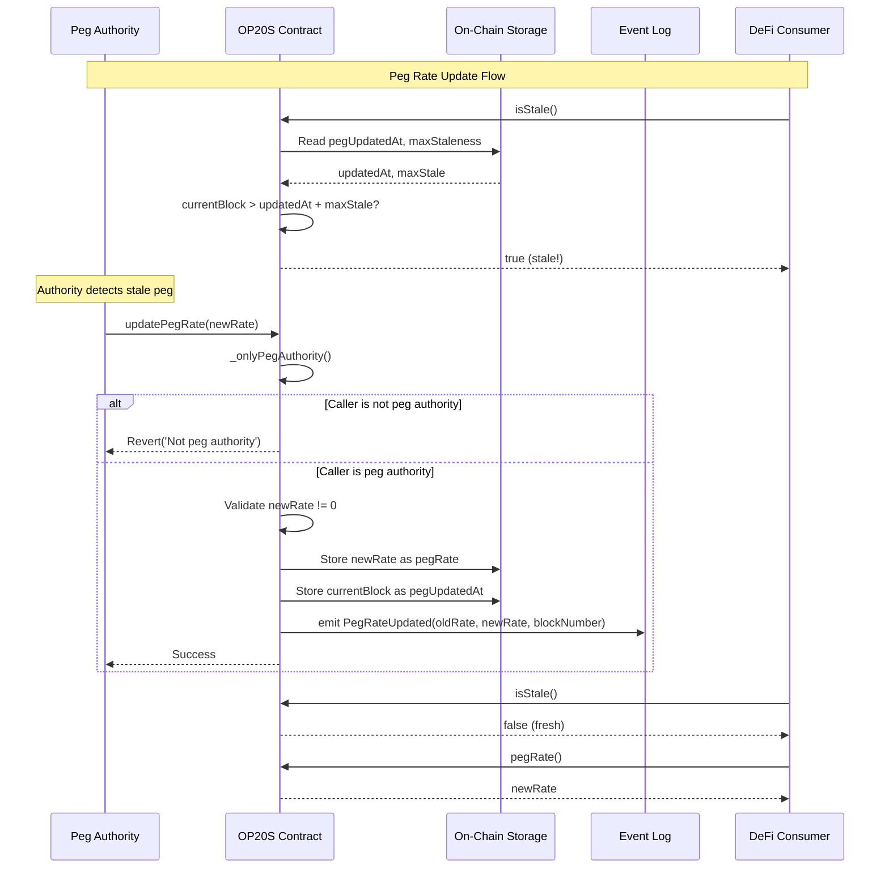
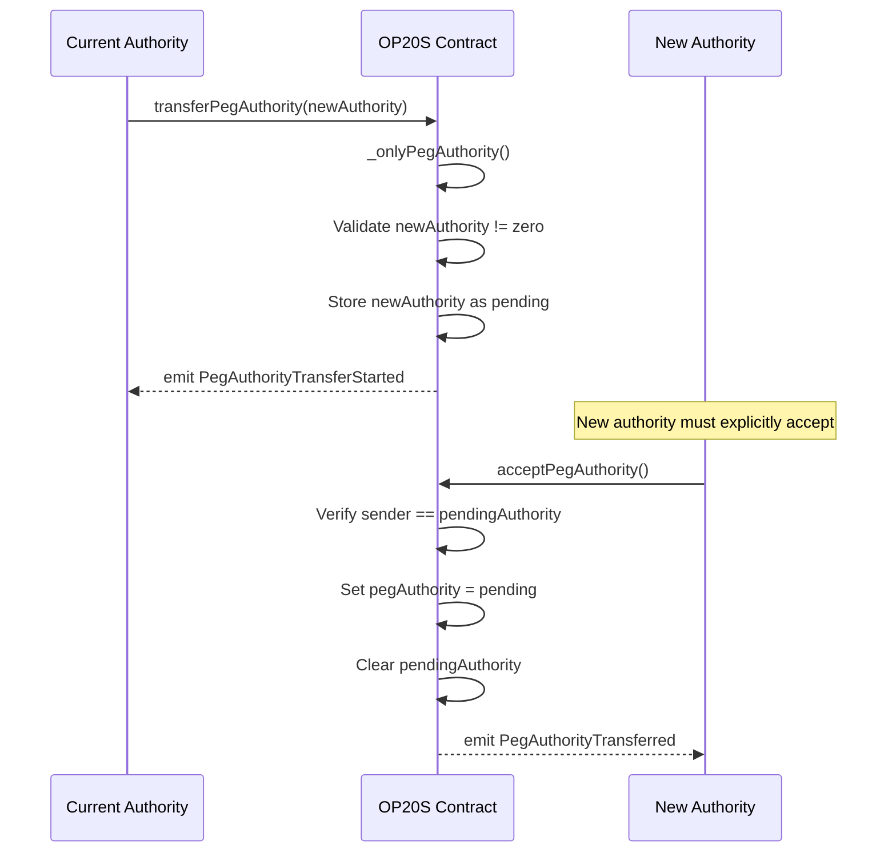

# OP20S - Stablecoin / Pegged-Token Base

OP20S extends OP20 with a peg-rate oracle system, providing a base class for stablecoins and pegged tokens on OPNet. It manages an on-chain exchange rate (the "peg"), a designated peg authority, and staleness checks to ensure the peg rate stays fresh.

## Overview

OP20S adds the following capabilities on top of OP20:

- **Peg rate oracle** - On-chain exchange/peg rate stored and queryable by anyone
- **Peg authority** - A privileged address that can update the peg rate
- **Two-step authority transfer** - Safe transfer of peg authority via propose/accept pattern
- **Staleness checking** - Automatic detection of stale peg rates based on block age
- **Max staleness configuration** - Configurable threshold for how many blocks before the peg is considered stale

```typescript
import {
    OP20S,
    OP20InitParameters,
    Calldata,
    Address,
} from '@btc-vision/btc-runtime/runtime';
import { u256 } from '@btc-vision/as-bignum/assembly';

@final
export class MyStableCoin extends OP20S {
    public constructor() {
        super();
    }

    public override onDeployment(calldata: Calldata): void {
        const pegAuthority = calldata.readAddress();
        const initialPegRate = calldata.readU256();

        this.instantiate(new OP20InitParameters(
            u256.Max,   // maxSupply
            6,          // decimals
            'Stable USD',
            'SUSD'
        ));

        // Initialize the peg oracle: authority, rate, max staleness (in blocks)
        this.initializePeg(pegAuthority, initialPegRate, 144);
    }
}
```

## How Peg Rates Work

The peg rate represents the exchange rate between the stablecoin and its underlying asset (e.g., BTC or USD). The peg authority is responsible for keeping this rate updated on-chain. If the rate is not updated within the configured `maxStaleness` window (measured in blocks), the peg is considered stale and contracts can enforce freshness checks.

### Staleness Model

Staleness is calculated as:

```
isStale = currentBlockNumber > pegUpdatedAt + maxStaleness
```

For example, with `maxStaleness = 144` (roughly 1 day of Bitcoin blocks), the peg authority must update the rate at least once every 144 blocks to keep it fresh.

## Peg Update Flow

The following diagram shows the complete lifecycle of a peg rate update:



## Peg Authority Transfer

OP20S uses a two-step authority transfer pattern to prevent accidental loss of authority:



## Initialization

In your contract's `onDeployment`, call `initializePeg()` after `instantiate()`:

```typescript
protected initializePeg(
    pegAuthority: Address,  // Address authorized to update the peg
    initialPegRate: u256,   // Starting exchange rate
    maxStaleness: u64       // Max blocks before peg is considered stale
): void
```

All three parameters are validated:
- `pegAuthority` must not be the zero address
- `initialPegRate` must not be zero
- `maxStaleness` must not be zero

On success, it sets the initial peg state and emits a `PegRateUpdatedEvent`.

## Public Methods

### Read-Only (Constant) Methods

| Method | Selector | Returns | Description |
|--------|----------|---------|-------------|
| `pegRate()` | `0x4d1f6caf` | `u256` | Current peg/exchange rate |
| `pegAuthority()` | `0xd767a583` | `Address` | Current peg authority address |
| `pegUpdatedAt()` | `0x1e99d1a1` | `u64` | Block number when peg was last updated |
| `maxStaleness()` | `0x0b17a602` | `u64` | Maximum allowed blocks between peg updates |
| `isStale()` | `0x147c08ef` | `bool` | Whether the peg rate has exceeded its staleness window |

These selectors are excluded from environment-provided call routing via `isSelectorExcluded()`, meaning they are handled directly by the contract.

### State-Changing Methods

| Method | Parameters | Access | Description |
|--------|-----------|--------|-------------|
| `updatePegRate(newRate)` | `newRate: u256` | Peg authority only | Update the peg rate; reverts if `newRate` is zero |
| `updateMaxStaleness(newStaleness)` | `newStaleness: u64` | Peg authority only | Update the max staleness window; reverts if zero |
| `transferPegAuthority(newAuthority)` | `newAuthority: Address` | Peg authority only | Start a two-step authority transfer |
| `acceptPegAuthority()` | (none) | Pending authority only | Complete the authority transfer |
| `renouncePegAuthority()` | (none) | Peg authority only | Permanently renounce peg authority (sets to zero address) |

### Inherited from OP20

OP20S inherits all standard OP20 token methods including `transfer`, `transferFrom`, `approve`, `increaseAllowance`, `decreaseAllowance`, `balanceOf`, `totalSupply`, `name`, `symbol`, `decimals`, and `allowance`. It also inherits signature-based approval methods (`increaseAllowanceBySignature`, `decreaseAllowanceBySignature`) from the base OP20 class.

## Events

| Event | Data Fields | Description |
|-------|-------------|-------------|
| `PegRateUpdated` | `oldRate: u256`, `newRate: u256`, `updatedAt: u64` | Emitted when the peg rate changes |
| `PegAuthorityTransferStarted` | `currentAuthority: Address`, `pendingAuthority: Address` | Emitted when authority transfer is initiated |
| `PegAuthorityTransferred` | `previousAuthority: Address`, `newAuthority: Address` | Emitted when authority transfer is completed |
| `PegAuthorityRenounced` | `previousAuthority: Address` | Emitted when authority is permanently renounced |
| `MaxStalenessUpdated` | `oldStaleness: u64`, `newStaleness: u64` | Emitted when the max staleness window is changed |

## Protected Methods

These methods are available to subclasses for internal logic:

| Method | Description |
|--------|-------------|
| `initializePeg(pegAuthority, initialPegRate, maxStaleness)` | Set up peg state during deployment |
| `_isStale(): boolean` | Check if the peg rate has exceeded its staleness window |
| `_requireFreshPeg(): void` | Revert with `'Peg rate stale'` if the peg is stale |
| `_onlyPegAuthority(): void` | Revert with `'Not peg authority'` if caller is not the authority |

The `_requireFreshPeg()` guard is particularly useful in subclasses to prevent operations (like minting or transfers) when the oracle data is outdated:

```typescript
public override mint(calldata: Calldata): BytesWriter {
    this._onlyMinter();
    this._requireFreshPeg();  // Ensure peg is current before minting
    // ... mint logic
}
```

## Storage Layout

OP20S uses the following storage pointers (allocated via `Blockchain.nextPointer` after OP20's pointers):

| Pointer | Type | Description |
|---------|------|-------------|
| `pegRatePointer` | `StoredU256` | The current peg rate |
| `pegAuthorityPointer` | `AddressMemoryMap` | The current peg authority address |
| `pegUpdatedAtPointer` | `StoredU256` | Block number of last peg update |
| `maxStalenessPointer` | `StoredU256` | Maximum staleness in blocks |
| `pendingAuthorityPointer` | `AddressMemoryMap` | Pending authority for two-step transfer |

## Example: Full Stablecoin Contract

The following example demonstrates a production-style stablecoin built on OP20S, inspired by the USDC model with role-based access control:

```typescript
import { u256 } from '@btc-vision/as-bignum/assembly';
import {
    Address,
    Blockchain,
    BytesWriter,
    Calldata,
    OP20InitParameters,
    OP20S,
    Revert,
    Selector,
    StoredBoolean,
} from '@btc-vision/btc-runtime/runtime';
import { AddressMemoryMap } from '@btc-vision/btc-runtime/runtime/memory/AddressMemoryMap';

const ownerPointer: u16 = Blockchain.nextPointer;
const pendingOwnerPointer: u16 = Blockchain.nextPointer;
const minterPointer: u16 = Blockchain.nextPointer;
const blacklisterPointer: u16 = Blockchain.nextPointer;
const pauserPointer: u16 = Blockchain.nextPointer;
const pausedPointer: u16 = Blockchain.nextPointer;
const blacklistMapPointer: u16 = Blockchain.nextPointer;

@final
export class MyStableCoin extends OP20S {
    private readonly _ownerMap: AddressMemoryMap;
    private readonly _pendingOwnerMap: AddressMemoryMap;
    private readonly _minterMap: AddressMemoryMap;
    private readonly _blacklisterMap: AddressMemoryMap;
    private readonly _pauserMap: AddressMemoryMap;
    private readonly _paused: StoredBoolean;
    private readonly _blacklist: AddressMemoryMap;

    public constructor() {
        super();
        this._ownerMap = new AddressMemoryMap(ownerPointer);
        this._pendingOwnerMap = new AddressMemoryMap(pendingOwnerPointer);
        this._minterMap = new AddressMemoryMap(minterPointer);
        this._blacklisterMap = new AddressMemoryMap(blacklisterPointer);
        this._pauserMap = new AddressMemoryMap(pauserPointer);
        this._paused = new StoredBoolean(pausedPointer, false);
        this._blacklist = new AddressMemoryMap(blacklistMapPointer);
    }

    public override onDeployment(calldata: Calldata): void {
        const owner = calldata.readAddress();
        const minter = calldata.readAddress();
        const blacklister = calldata.readAddress();
        const pauser = calldata.readAddress();
        const pegAuthority = calldata.readAddress();
        const initialPegRate = calldata.readU256();

        // Initialize OP20 token
        this.instantiate(new OP20InitParameters(
            u256.Max,       // maxSupply (unlimited for stablecoin)
            6,              // decimals (USDC-style)
            'Stable USD',
            'SUSD'
        ));

        // Initialize peg oracle with 144-block staleness (~1 day)
        this.initializePeg(pegAuthority, initialPegRate, 144);

        // Set up roles
        this._setOwner(owner);
        this._setMinter(minter);
        this._setBlacklister(blacklister);
        this._setPauser(pauser);
    }

    @method(
        { name: 'to', type: ABIDataTypes.ADDRESS },
        { name: 'amount', type: ABIDataTypes.UINT256 },
    )
    @emit('Minted')
    public mint(calldata: Calldata): BytesWriter {
        this._onlyMinter();
        this._requireNotPaused();

        const to = calldata.readAddress();
        const amount = calldata.readU256();

        this._requireNotBlacklisted(to);
        this._mint(to, amount);

        return new BytesWriter(0);
    }

    @method(
        { name: 'from', type: ABIDataTypes.ADDRESS },
        { name: 'amount', type: ABIDataTypes.UINT256 },
    )
    @emit('Burned')
    public burnFrom(calldata: Calldata): BytesWriter {
        this._onlyMinter();
        this._requireNotPaused();

        const from = calldata.readAddress();
        const amount = calldata.readU256();

        this._burn(from, amount);

        return new BytesWriter(0);
    }

    // Blacklisting, pausing, ownership transfer, etc.
    // See full example in example-tokens/src/stablecoin/MyStableCoin.ts

    protected override _transfer(from: Address, to: Address, amount: u256): void {
        this._requireNotPaused();
        this._requireNotBlacklisted(from);
        this._requireNotBlacklisted(to);
        this._requireNotBlacklisted(Blockchain.tx.sender);

        super._transfer(from, to, amount);
    }

    // ... role management helpers omitted for brevity
}
```

Key patterns demonstrated:
- **`initializePeg()`** is called during `onDeployment` after `instantiate()`
- **Role separation**: owner, minter, blacklister, pauser, and peg authority are distinct addresses
- **Blacklist + pause guards** on transfers and allowances via overrides
- **Two-step ownership transfer** (same pattern as peg authority transfer)

## Security Considerations

### Peg Authority Compromise

If the peg authority key is compromised, an attacker could set an arbitrary peg rate. Mitigations:

1. **Use a multisig** as the peg authority address
2. **Monitor `PegRateUpdated` events** for unexpected rate changes
3. **Implement rate change limits** in your subclass (e.g., max percentage change per update)
4. **Set a reasonable `maxStaleness`** so the peg automatically becomes stale if the authority stops updating

### Staleness Risks

- If the peg authority fails to update the rate, `isStale()` returns `true`. DeFi protocols integrating with the stablecoin should call `_requireFreshPeg()` or check `isStale()` before relying on the rate.
- Setting `maxStaleness` too low may cause false staleness during network congestion.
- Setting `maxStaleness` too high reduces the effectiveness of the staleness check.

### Authority Renunciation

Calling `renouncePegAuthority()` is irreversible. Once renounced, the peg rate can never be updated again. This is only appropriate if the peg rate is meant to be permanently fixed.

### Rate Manipulation

Consider adding bounds checking in your subclass to limit how much the peg rate can change in a single update:

```typescript
public override updatePegRate(calldata: Calldata): BytesWriter {
    // Read the new rate before the parent processes it
    const newRate = calldata.readU256();
    const currentRate = this._pegRate.value;

    // Enforce max 5% change per update
    const maxDelta = currentRate / u256.fromU32(20);
    const diff = newRate > currentRate
        ? newRate - currentRate
        : currentRate - newRate;

    if (diff > maxDelta) {
        throw new Revert('Rate change too large');
    }

    return super.updatePegRate(calldata);
}
```

## Comparison with Ethereum Stablecoins

| Feature | USDC (Ethereum) | OP20S (OPNet) |
|---------|----------------|---------------|
| Language | Solidity | AssemblyScript |
| Peg rate | Off-chain oracle (Chainlink) | On-chain peg authority |
| Authority model | Centralized admin | Peg authority with two-step transfer |
| Staleness | Oracle heartbeat | Block-based maxStaleness |
| Pausable | Yes (via Pausable) | Subclass responsibility |
| Blacklist | Yes (via Blacklistable) | Subclass responsibility |
| Authority renunciation | N/A | Built-in `renouncePegAuthority()` |

---

**Navigation:**
- Previous: [OP20 Token](./op20-token.md)
- Next: [OP721 NFT](./op721-nft.md)
