# Threshold ML-DSA: Post-Quantum t-of-n Threshold Signing

## Technical Whitepaper

**Version 1.1** | **February 2025**

Based on *"Threshold Signatures Reloaded"* (Borin, Celi, del Pino, Espitau, Niot, Prest, 2025).

Extended beyond the [Go reference implementation](https://github.com/GuilhemN/threshold-ml-dsa-and-raccoon) (Cloudflare CIRCL) with a full 3-round distributed signing protocol, security hardening for 5 known vulnerabilities in the Go reference, and native TypeScript class architecture.

---

## Table of Contents

1. [Introduction](#1-introduction)
2. [Account-Level Threshold Multisig](#2-account-level-threshold-multisig)
3. [Comparison with Existing Approaches](#3-comparison-with-existing-approaches)
4. [Innovations Beyond the Go Reference](#4-innovations-beyond-the-go-reference)
5. [Mathematical Foundations](#5-mathematical-foundations)
6. [ML-DSA (FIPS 204) Background](#6-ml-dsa-fips-204-background)
7. [Threshold Construction Overview](#7-threshold-construction-overview)
8. [Key Generation: Trusted Dealer DKG](#8-key-generation-trusted-dealer-dkg)
9. [Hyperball Sampling](#9-hyperball-sampling)
10. [Share Recovery](#10-share-recovery)
11. [The 3-Round Distributed Signing Protocol](#11-the-3-round-distributed-signing-protocol)
12. [Combine: Signature Finalization](#12-combine-signature-finalization)
13. [Polynomial Packing: 23-Bit Encoding](#13-polynomial-packing-23-bit-encoding)
14. [Parameter Tables](#14-parameter-tables)
15. [Security Analysis and Hardening](#15-security-analysis-and-hardening)
16. [Float64 Precision Analysis](#16-float64-precision-analysis)
17. [Architecture and Implementation](#17-architecture-and-implementation)
18. [API Reference](#18-api-reference)
19. [Known Limitations](#19-known-limitations)

---

## 1. Introduction

### 1.1 Problem Statement

Post-quantum cryptography demands new approaches to multi-party custody. Classical threshold ECDSA/Schnorr schemes (MuSig2, FROST) do not survive quantum attacks. ML-DSA (FIPS 204, formerly CRYSTALS-Dilithium) is the NIST-standardized post-quantum signature scheme, but it is inherently a single-signer construction. We need a way for T-of-N parties to collaboratively produce a valid ML-DSA signature without any single party holding the full signing key — and we need the signing to happen in a fully distributed manner, where each party generates their own randomness independently, like Bitcoin multisig but post-quantum.

### 1.2 Solution

This implementation provides threshold ML-DSA signing where:

- **T** parties (threshold) out of **N** total parties (2 <= T <= N <= 6) can collaboratively sign
- The output is a **standard FIPS 204 signature** — 2,420 bytes for ML-DSA-44, 3,309 bytes for ML-DSA-65, 4,627 bytes for ML-DSA-87 — identical to a single-signer signature, verifiable by `ml_dsa44.verify()` / `ml_dsa65.verify()` / `ml_dsa87.verify()`
- No verifier can distinguish a threshold signature from a single-signer signature
- **The signature size never changes** regardless of T or N. A 2-of-2 and a 6-of-6 produce the same 2,420-byte ML-DSA-44 signature
- No single party ever holds the complete signing key
- **Signing is fully distributed**: each party generates their own commitment independently, on their own machine, disconnected — then exchanges messages over any channel to produce the signature
- All three NIST security levels are supported: ML-DSA-44 (128-bit), ML-DSA-65 (192-bit), ML-DSA-87 (256-bit)

### 1.3 Trust Model

- **Honest majority**: fewer than T parties are malicious
- **Trusted dealer keygen**: a single dealer generates all shares (can be mitigated with MPC or air-gapped generation)
- **Distributed signing**: no party reveals their secret during signing — each party independently generates randomness, computes their partial response locally, and only shares commitments/responses
- **Identifiable aborts**: malicious parties can cause signing failures but cannot forge signatures or extract other parties' shares

### 1.4 Signature Size: Always Standard FIPS 204

This is critical to understand: **the threshold configuration (T, N) does not affect the signature size at all.**

| Level | Standard signature | Threshold signature (any T,N) | Identical? |
|-------|-------------------|------------------------------|-----------|
| ML-DSA-44 | 2,420 bytes | 2,420 bytes | Yes |
| ML-DSA-65 | 3,309 bytes | 3,309 bytes | Yes |
| ML-DSA-87 | 4,627 bytes | 4,627 bytes | Yes |

The signature is always `sigCoder.encode([c̃, z, h])` — the challenge hash, the aggregate response, and the hint. These are the same fields with the same sizes as standard ML-DSA. The threshold math happens entirely during signing; by the time the signature is produced, it is byte-for-byte a standard FIPS 204 signature.

A verifier given a threshold-produced signature and a standard signature cannot tell them apart. This is not a wrapper format or an extension — it IS a standard ML-DSA signature.

---

## 2. Account-Level Threshold Multisig

### 2.1 The Vision: Your Account IS the Multisig

In account-model blockchains like OPNet, every account is identified by its ML-DSA public key. With threshold ML-DSA, the public key can be a **threshold key** — one that requires T-of-N parties to sign — while looking identical to any other ML-DSA public key on-chain.

This is not a smart contract multisig. This is **the account itself being a multisig**. The distinction is fundamental:

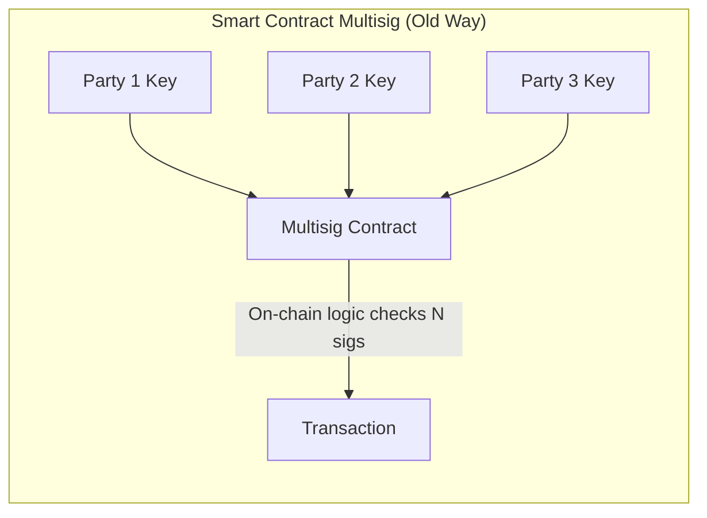

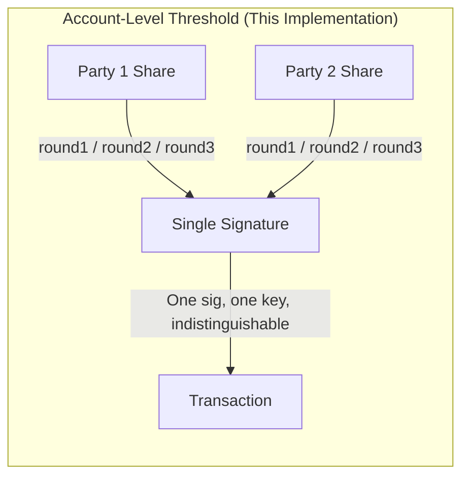

### 2.2 How It Works on OPNet

OPNet uses an account model where every account is identified by its ML-DSA key. With threshold ML-DSA, **the account itself becomes the multisig** — not at the contract level, not at the application level, but at the account level. Below the contract. Below everything.

**Setup (one-time)**:
1. A group of N parties runs `keygen()` to produce one ML-DSA public key and N key shares
2. The public key becomes an OPNet address — just like any other address
3. Each party stores their key share securely on their own device
4. The seed is destroyed. No single entity holds the full secret.

**Every operation (signing)**:
1. Any T parties coordinate via the 3-round distributed protocol: `round1()` → `round2()` → `round3()` → `combine()`
2. Each party generates their own randomness **on their own machine, offline, disconnected** — like Bitcoin multisig
3. They exchange only commitments and responses over any channel (no secrets ever leave any device)
4. The output is one standard ML-DSA signature (2,420 bytes for ML-DSA-44)

**On-chain**: The blockchain sees one address, one signature, one transaction. `tx.origin` is the aggregated ML-DSA public key. The contract doesn't know or care that 3 people signed — it just sees one valid ML-DSA signature from one address. Indistinguishable from a single-signer account.

This works for **every operation on OPNet** — not just token transfers. Deployments, admin calls, parameter changes, everything. Because the multisig lives at the account level, below the contract, every transaction from that address inherits the threshold protection automatically. No smart contract logic needed. No on-chain multisig overhead. Just one address, one signature.

### 2.3 What This Enables

| Capability | Smart Contract Multisig | Account-Level Threshold |
|-----------|------------------------|------------------------|
| Contract deployer | Single key (single point of failure) | Threshold group (no single compromise) |
| Token admin keys | N-of-N via on-chain logic | N-of-N via aggregated ML-DSA key. Nobody can tell it's multisig. |
| Transaction signing | Multiple signatures verified on-chain | One signature, zero overhead |
| `tx.origin` | One signer's address | Aggregated identity — 3 people signed, chain sees 1 address |
| Visibility | On-chain, anyone can see it's multisig | **Invisible** — looks like a normal account |
| Gas cost | Verifying N signatures + contract logic | Verifying 1 signature (same as any normal transaction) |
| Scope | Only operations the contract supports | **EVERY** operation: transfers, deployments, admin calls, parameter changes |
| Signing model | Each signer submits separately on-chain | **Distributed**: each party signs offline on own device, like Bitcoin multisig |
| Key custody | N individual keys stored independently | N shares; no single share can sign. Secret key never exists in one place. |

### 2.4 Concrete Examples

**Corporate treasury (4-of-7)**:
```typescript
const th = ThresholdMLDSA.create(87, 4, 7);  // NIST Level 5, maximum security
const { publicKey, shares } = th.keygen();
// publicKey → OPNet address for the treasury
// shares[0] → CEO's hardware wallet
// shares[1] → CFO's hardware wallet
// shares[2..6] → Board members' hardware wallets
// Any 4 can authorize any transaction. Nobody can tell it's a multisig.
```

**Multi-party contract deployment**:
```typescript
// The deployer address is a 3-of-5 threshold key.
// No single developer can deploy malicious code.
// The chain just sees: address X deployed contract Y.
```

**Token admin rotation**:
```typescript
// Admin key for a token contract = threshold key.
// Even if 1 admin is compromised, attacker cannot:
// - mint tokens (needs 3 of 5)
// - change parameters (needs 3 of 5)
// - upgrade contract (needs 3 of 5)
// Zero on-chain multisig logic needed.
```

**Distributed signing in action (3-of-5 board signing a deployment)**:
```typescript
const th = ThresholdMLDSA.create(44, 3, 5);
const { publicKey, shares } = th.keygen();
// Distribute shares[0..4] to 5 board members. Destroy seed.

// Later: 3 board members (0, 2, 4) want to sign a deployment tx.
// Each runs round1() on their own device:
const r1_0 = th.round1(shares[0]); // CEO's phone
const r1_2 = th.round1(shares[2]); // CTO's laptop
const r1_4 = th.round1(shares[4]); // CFO's hardware wallet

// Exchange 32-byte hashes over Signal/email/anything:
const hashes = [r1_0.commitmentHash, r1_2.commitmentHash, r1_4.commitmentHash];

// Each runs round2() independently:
const r2_0 = th.round2(shares[0], [0,2,4], deployTx, hashes, r1_0.state);
const r2_2 = th.round2(shares[2], [0,2,4], deployTx, hashes, r1_2.state);
const r2_4 = th.round2(shares[4], [0,2,4], deployTx, hashes, r1_4.state);

// Exchange commitments, each runs round3():
const commits = [r2_0.commitment, r2_2.commitment, r2_4.commitment];
const z0 = th.round3(shares[0], commits, r1_0.state, r2_0.state);
const z2 = th.round3(shares[2], commits, r1_2.state, r2_2.state);
const z4 = th.round3(shares[4], commits, r1_4.state, r2_4.state);

// Anyone can combine (no secrets needed):
const sig = th.combine(publicKey, deployTx, commits, [z0, z2, z4]);
// sig is a standard 2,420-byte FIPS 204 signature.
// The chain sees: address X deployed contract Y. One signature. One address.
```

### 2.5 Why This Matters for Post-Quantum

Every other chain's multisig is built on pre-quantum cryptography:
- Bitcoin MuSig2: Schnorr-based. Dead when quantum computers arrive.
- Ethereum Safe: ECDSA-based smart contract. Dead when quantum computers arrive.
- Cosmos multisig: secp256k1 on-chain verification. Dead.

This is the **first account-level threshold multisig that survives quantum computers**, based on a NIST-standardized algorithm (FIPS 204), producing signatures that any ML-DSA verifier can validate without knowing they're threshold-produced.

---

## 3. Comparison with Existing Approaches

### 3.1 vs Bitcoin MuSig2

MuSig2 is the state-of-the-art for Bitcoin Schnorr key aggregation (N-of-N). The comparison:

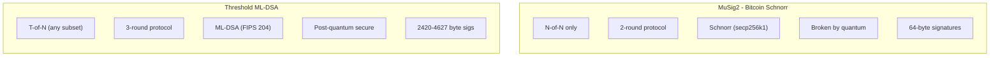

| Property | MuSig2 | FROST | Threshold ML-DSA |
|----------|--------|-------|-----------------|
| Threshold | N-of-N only | T-of-N | T-of-N |
| Rounds | 2 | 2 | 3 |
| Quantum-safe | No | No | Yes (NIST FIPS 204) |
| Signature size | 64 bytes | 64 bytes | 2,420-4,627 bytes |
| On-chain distinguishable | No | No | No |
| Math basis | Discrete log | Discrete log | Module-LWE + Module-SIS |
| Signing complexity | Simple linear | Simple linear | Hyperball + rejection sampling |
| Standard | BIP-327 | RFC 9591 | "Threshold Signatures Reloaded" |

**Key takeaway**: MuSig2 and FROST are elegant because Schnorr's linearity makes threshold trivial. ML-DSA's non-linearity (rejection sampling, decomposition) makes threshold far harder — the hyperball construction is the breakthrough that makes it work. But only the lattice-based approach survives quantum.

### 3.2 vs Smart Contract Multisig

Smart contract multisig (Gnosis Safe, opMultisig, etc.) operates at the application layer:

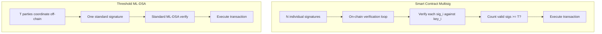

| Property | Smart Contract Multisig | Threshold ML-DSA |
|----------|------------------------|------------------|
| Gas cost | O(N) signature verifications | O(1) — one verification |
| Privacy | Everyone sees it's multisig | Invisible — looks like normal account |
| Scope | Limited to contract operations | ALL operations (transfers, deploys, calls) |
| Complexity | On-chain contract logic | Zero on-chain logic |
| Account type | Contract account (different from EOA) | Standard account |
| Upgradeability | Contract must support it | Any operation, no contract changes |
| Sig size on-chain | N × signature_size | 1 × signature_size |

### 3.3 The MuSig3 Parallel

If MuSig2 gave Bitcoin 2-round N-of-N Schnorr aggregation, then this implementation is effectively **"MuSig3"** — but for post-quantum lattices:

- **MuSig2**: 2-round, N-of-N, Schnorr, pre-quantum, 64-byte sigs
- **FROST**: 2-round, T-of-N, Schnorr, pre-quantum, 64-byte sigs
- **This**: 3-round, T-of-N, ML-DSA, **post-quantum**, 2,420-byte sigs

The extra round (commit-then-reveal) is necessary because ML-DSA's non-linear operations require stronger commitment binding than Schnorr's linear structure. The 3rd round also enables commitment hash verification, which catches cheating parties.

**What this replaces:**

Every blockchain multisig today is built on pre-quantum cryptography. Bitcoin's MuSig2 uses Schnorr over secp256k1. Ethereum's Safe uses ECDSA via smart contracts. Cosmos, Solana, and others rely on the same elliptic curve primitives. None of these survive quantum computers. And the smart contract multisigs that exist today (opMultisig, Gnosis Safe, etc.) operate at the application layer: they verify N individual signatures on-chain, costing N times the gas, visible to everyone as multisig.

This is fundamentally different: **native account-level multisig with zero smart contract overhead. Post-quantum. Invisible on-chain. Working for every operation — not just transfers, but deployments, admin calls, parameter changes, everything.** The output is a single standard FIPS 204 signature indistinguishable from a single-signer account.

### 3.4 Concrete Comparison: 3-of-4 vs 3-of-6

To illustrate how the protocol scales, consider two real configurations:

**3-of-4 Threshold (small board)**:

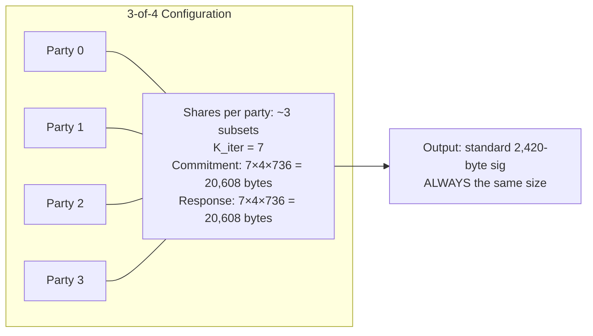

- C(4, 4-3+1) = C(4,2) = **6 honest-signer subsets** during keygen
- Each party stores shares for ~3 of these subsets
- K_iter = 7 parallel signing iterations per round
- Per-round commitment: 7 × 4 × 736 = **20,608 bytes** broadcast per party
- Per-round response: 7 × 4 × 736 = **20,608 bytes** broadcast per party
- **Output**: standard 2,420-byte ML-DSA-44 signature

**3-of-6 Threshold (larger board)**:

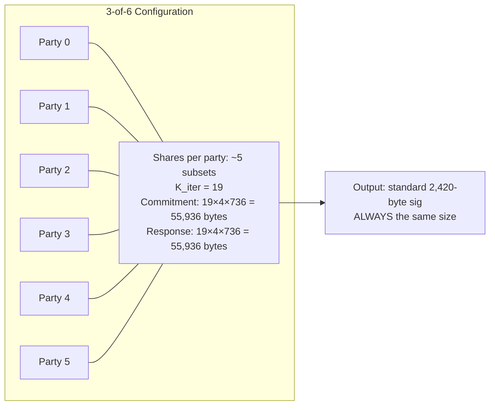

- C(6, 6-3+1) = C(6,4) = **15 honest-signer subsets** during keygen
- Each party stores shares for ~5 of these subsets
- K_iter = 19 parallel signing iterations per round
- Per-round commitment: 19 × 4 × 736 = **55,936 bytes** broadcast per party
- Per-round response: 19 × 4 × 736 = **55,936 bytes** broadcast per party
- **Output**: standard 2,420-byte ML-DSA-44 signature

**The signature is always 2,420 bytes.** The extra communication during signing (commitment + response) grows with K_iter but this is **off-chain** — it's the messages parties exchange during the 3-round protocol. On-chain, only the final 2,420-byte signature appears.

### 3.5 Why N <= 6

N is capped at 6 for mathematical and practical reasons:

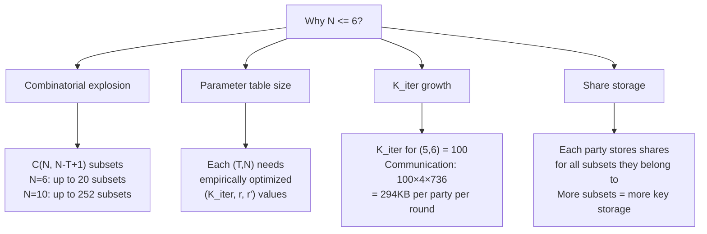

The key constraint: **K_iter grows rapidly with T and N**. For (T=5, N=6), K_iter = 100, meaning each signing round requires 100 parallel attempts. This is because the combinatorial structure of the share recovery makes each individual attempt less likely to succeed — more iterations are needed to guarantee at least one succeeds.

The **signature size never changes** — it's always standard FIPS 204. But the communication during signing (off-chain, between parties) grows with K_iter. Beyond N=6, this communication becomes impractical for interactive signing.

Importantly, **the output is always NIST-valid**: a 2,420-byte ML-DSA-44 signature (or 3,309 for ML-DSA-65, or 4,627 for ML-DSA-87). The verifier never sees N, T, or K_iter.

---

## 4. Innovations Beyond the Go Reference

### 4.1 What the Go Reference Provides

The [Go reference implementation](https://github.com/GuilhemN/threshold-ml-dsa-and-raccoon) (built on Cloudflare CIRCL) implements:
- Trusted dealer key generation (`NewThresholdKeysFromSeed`)
- Local threshold signing (`ThresholdSign`) — runs all rounds in one function call
- Hyperball sampling, share recovery, parameter tables for ML-DSA-44

It does **NOT** provide:
- Individual round functions for distributed signing over a network
- State management between rounds
- Commitment hash verification
- Security hardening for the audit findings
- ML-DSA-65 or ML-DSA-87 parameter tables

### 4.2 What We Added: Distributed Signing Protocol

The Go reference can only sign locally — all parties' key shares must be in the same process. **This is not a real multisig.** It's like having a "multisig" where one person holds all the keys. It's a cryptographic building block, not a usable protocol.

We implemented what the Go reference does not: the full 3-round distributed protocol where **each party runs independently on their own machine, offline, disconnected** — generating their own randomness, computing their own partial response, never revealing their secret share. This is how real multisig works: like Bitcoin, like MuSig2, but post-quantum.

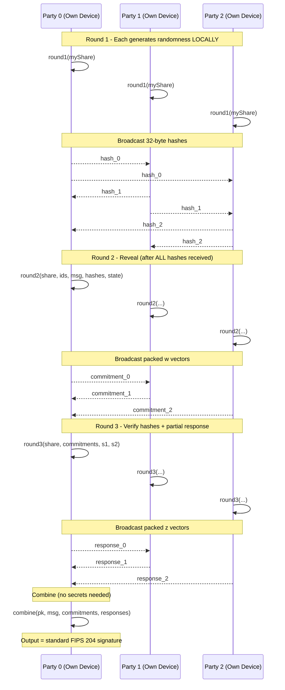

**No party's secret ever leaves their device.** Each party:
1. Generates their own randomness locally (`round1`)
2. Reveals only their commitment — a polynomial vector, not their secret (`round2`)
3. Computes their partial response using their local secret share (`round3`)
4. The partial responses are combined publicly — anyone can do it (`combine`)

This is the Bitcoin multisig model: offline, disconnected parties each contribute their part. The Go reference cannot do this.

### 4.3 Security Hardening of Go Reference Vulnerabilities

The Go reference implementation has **known vulnerabilities** identified in its audit report. We applied all applicable fixes:

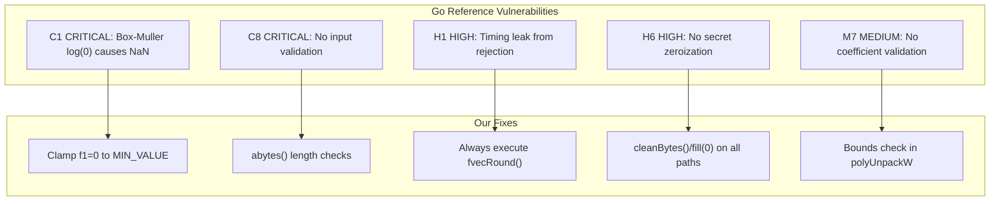

Plus hardening the Go reference does NOT have:
- **Duplicate share ID validation**: prevents incorrect bitmask construction
- **Commitment hash verification in round3**: catches cheating parties (constant-time comparison)
- **State destruction classes**: `Round1State.destroy()` / `Round2State.destroy()` with `#private` fields
- **Failure-path cleanup**: mu zeroed even when all 500 attempts exhausted

### 4.4 ML-DSA-65 and ML-DSA-87 Support

The Go reference only provides parameter tables for ML-DSA-44. We derived and validated parameter tables for all three NIST security levels:
- **ML-DSA-44** (K=4, L=4): exact from Go reference
- **ML-DSA-65** (K=6, L=5): derived from same formulas, scaled
- **ML-DSA-87** (K=8, L=7): derived from same formulas, scaled

All 45 (T,N,level) configurations produce valid FIPS 204 signatures, verified by tests.

### 4.5 Summary: Go Reference vs This Implementation

| Feature | Go Reference | This Implementation |
|---------|-------------|---------------------|
| Local signing | Yes | Yes (`sign()`) |
| Distributed signing | **No** | **Yes** (`round1`→`round2`→`round3`→`combine`) |
| Security levels | ML-DSA-44 only | ML-DSA-44, ML-DSA-65, ML-DSA-87 |
| Audit fixes applied | No | Yes (C1, C8, H1, H6, M7) |
| Secret zeroization | No | Yes (all paths) |
| Input validation | No | Yes |
| Timing leak fix | No | Yes |
| State management | N/A | `#private` fields + `destroy()` |
| Commitment verification | N/A | Constant-time hash check in round3 |
| Duplicate ID detection | No | Yes |

---

## 5. Mathematical Foundations

### 5.1 The Ring R_q

All arithmetic operates in the polynomial ring:

```
R_q = Z_q[X] / (X^256 + 1)
```

where:
- **q = 8,380,417** (the Dilithium prime, 23 bits: 2^23 - 2^13 + 1)
- **N = 256** (polynomial degree)
- Elements are polynomials of degree <= 255 with coefficients in Z_q

This ring is chosen because:
1. q ≡ 1 (mod 2N), enabling efficient NTT (Number Theoretic Transform)
2. X^256 + 1 is the 512th cyclotomic polynomial, irreducible over Z
3. The resulting ring is isomorphic (via NTT) to Z_q^256, making pointwise multiplication possible

### 5.2 Number Theoretic Transform (NTT)

The NTT is the finite-field analogue of the FFT. For our ring:

```
NTT: R_q → Z_q^256
```

Given a primitive 512th root of unity ζ = 1753 in Z_q (i.e., ζ^512 ≡ 1 mod q and ζ^256 ≡ -1 mod q):

```
NTT(a)[i] = Σ_{j=0}^{255} a[j] · ζ^{brv(i) · (2j+1)} mod q
```

where `brv(i)` is the 8-bit bit-reversal of i.

**Why NTT matters for threshold signing**: Polynomial multiplication in R_q is O(N^2) naively, but NTT reduces it to O(N log N). Since threshold signing requires many polynomial multiplications (computing A·z, c·s, etc.), NTT is essential for performance. In NTT domain, multiplication is pointwise:

```
NTT(a · b) = NTT(a) ⊙ NTT(b)    (component-wise multiplication)
```

**Implementation note**: Since q is 23 bits, the product a[i]·b[i] is at most 46 bits. JavaScript's `Number` type provides 53 bits of integer precision (IEEE 754 double), so all NTT arithmetic stays within safe integer range. This avoids the need for BigInt in ring operations — a critical performance decision.

### 5.3 Modular Arithmetic

Two modular reduction functions are used throughout:

**`mod(a, q)`**: Standard unsigned reduction to [0, q):
```
mod(a) = ((a % q) + q) % q
```

**`smod(a, q)`**: Centered/signed reduction to [-(q-1)/2, (q-1)/2]:
```
smod(a) = mod(a + (q-1)/2) - (q-1)/2
```

The centered form is essential for norm checks (e.g., `polyChknorm`) where we need to test if coefficients are "small" — checking |smod(a[i])| < B is meaningless without centering.

### 5.4 Decomposition Functions

ML-DSA uses several decomposition functions, parameterized by γ₂:

**Power2Round(r)**: Splits r into high and low parts relative to 2^d (d=13):
```
r₊ = mod(r)
r₀ = smod(r₊, 2^d)         # low d bits, centered
r₁ = (r₊ - r₀) / 2^d       # high bits
```
Used to split the public key: t = t₁·2^d + t₀.

**Decompose(r)**: Splits r relative to 2γ₂:
```
r₊ = mod(r)
r₀ = smod(r₊, 2γ₂)         # low bits, centered
r₁ = (r₊ - r₀) / (2γ₂)     # high bits
```
Special case: if r₊ - r₀ = q-1, return (r₁=0, r₀=r₀-1).

**HighBits(r)** = Decompose(r).r₁
**LowBits(r)** = Decompose(r).r₀

**MakeHint(z, r)**: Returns 1 if adding z to r changes HighBits:
```
MakeHint(z, r) = 0 if z <= γ₂ or z > q-γ₂ or (z = q-γ₂ and r = 0)
MakeHint(z, r) = 1 otherwise
```

**UseHint(h, r)**: Adjusts HighBits according to hint h:
```
If h=0: return r₁
If h=1: return (r₁ + 1) mod m if r₀ > 0, else (r₁ - 1) mod m
where m = (q-1)/(2γ₂)
```

These functions are central to how ML-DSA achieves compression: the signature contains z (the response), c̃ (the challenge hash), and h (the hint), from which the verifier can reconstruct w₁' = UseHint(h, Az - c·t₁·2^d) and check that H(μ || w₁') = c̃.

### 5.5 Sampling Functions

**RejNTTPoly(xof)**: Samples a uniformly random polynomial in NTT domain by rejection sampling from an XOF (SHAKE-128). Each 3-byte block yields a 23-bit candidate; values >= q are rejected.

**RejBoundedPoly(xof)**: Samples a polynomial with small coefficients in [-η, η] by rejection sampling from an XOF (SHAKE-256). For η=2, each nibble (4 bits) yields a candidate via `η - (t mod 5)` for t < 15. For η=4, each nibble t < 9 yields `4 - t`.

**SampleInBall(seed)**: Samples a sparse polynomial c ∈ R_q with exactly τ nonzero coefficients, each ±1. Uses Fisher-Yates-like shuffling seeded by SHAKE-256. This is the challenge polynomial in Fiat-Shamir.

---

## 6. ML-DSA (FIPS 204) Background

### 6.1 Standard ML-DSA Parameters

| Parameter | ML-DSA-44 | ML-DSA-65 | ML-DSA-87 |
|-----------|-----------|-----------|-----------|
| NIST Level | 2 (128-bit) | 3 (192-bit) | 5 (256-bit) |
| K (rows of A) | 4 | 6 | 8 |
| L (columns of A) | 4 | 5 | 7 |
| η (secret bound) | 2 | 4 | 2 |
| τ (challenge weight) | 39 | 49 | 60 |
| γ₁ (masking range) | 2^17 | 2^19 | 2^19 |
| γ₂ (decomposition) | (q-1)/88 | (q-1)/32 | (q-1)/32 |
| ω (hint weight) | 80 | 55 | 75 |
| β = τ·η | 78 | 196 | 120 |
| d (Power2Round) | 13 | 13 | 13 |
| c̃ bytes | 32 | 48 | 64 |
| Public key bytes | 1,312 | 1,952 | 2,592 |
| **Signature bytes** | **2,420** | **3,309** | **4,627** |

### 6.2 Standard ML-DSA Signing (Simplified)

Understanding standard ML-DSA is prerequisite to understanding threshold ML-DSA:

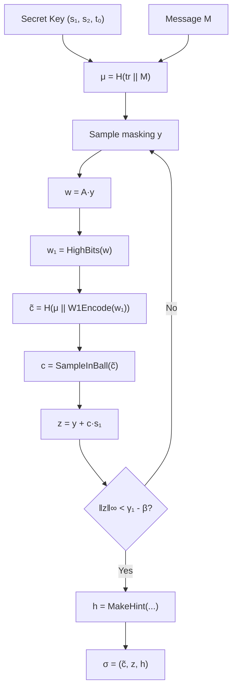

**Key Generation:**
1. Sample ρ (public seed), ρ' (secret seed), K (signing key)
2. Expand A ∈ R_q^{K×L} from ρ using XOF-128
3. Sample s₁ ∈ R_q^L, s₂ ∈ R_q^K with small coefficients (bound η)
4. Compute t = A·s₁ + s₂
5. Split t into (t₁, t₀) via Power2Round
6. Public key: pk = (ρ, t₁)
7. Secret key: sk = (ρ, K, tr, s₁, s₂, t₀) where tr = H(pk)

**Signing (rejection sampling loop):**
1. μ = H(tr || M) — message representative
2. ρ' = H(K || rnd || μ) — private randomness
3. Sample masking vector y ∈ R_q^L with coefficients in [-γ₁+1, γ₁]
4. w = A·y, compute w₁ = HighBits(w)
5. c̃ = H(μ || W1Encode(w₁)), c = SampleInBall(c̃)
6. z = y + c·s₁
7. Reject if ‖z‖∞ >= γ₁ - β or ‖LowBits(w - c·s₂)‖∞ >= γ₂ - β
8. Compute hint h = MakeHint(-c·t₀, w - c·s₂ + c·t₀)
9. Reject if weight(h) > ω
10. Signature: σ = (c̃, z, h)

**Verification:**
1. (ρ, t₁) = pkDecode(pk), (c̃, z, h) = sigDecode(σ)
2. Check ‖z‖∞ < γ₁ - β
3. c = SampleInBall(c̃), A = ExpandA(ρ)
4. w'_approx = A·z - c·t₁·2^d
5. w'₁ = UseHint(h, w'_approx)
6. c̃' = H(μ || W1Encode(w'₁))
7. Accept if c̃ = c̃'

### 6.3 Why Threshold ML-DSA is Hard

Unlike Schnorr/ECDSA where threshold signing is relatively straightforward (linear secret sharing + linear signature equation), ML-DSA has fundamental obstacles:

1. **Rejection sampling**: Standard ML-DSA rejects ~75% of signing attempts. With threshold signing, parties must coordinate their rejection — if one party rejects, all must restart.

2. **Non-linear operations**: The decomposition functions (HighBits, LowBits, MakeHint) are non-linear. They cannot be computed independently on shares and then combined.

3. **Lattice structure**: The masking vector y must hide the secret s₁ via z = y + c·s₁. In threshold setting, y must be jointly generated without any party learning the full y.

The "Threshold Signatures Reloaded" paper solves these problems using:
- **Hyperball sampling**: Replace uniform y with a carefully shaped continuous distribution, then round
- **Additive secret sharing**: Split s into shares that sum to s
- **Parallel iterations**: Run K_iter independent attempts per round to amortize the rejection probability

---

## 7. Threshold Construction Overview

### 7.1 High-Level Protocol

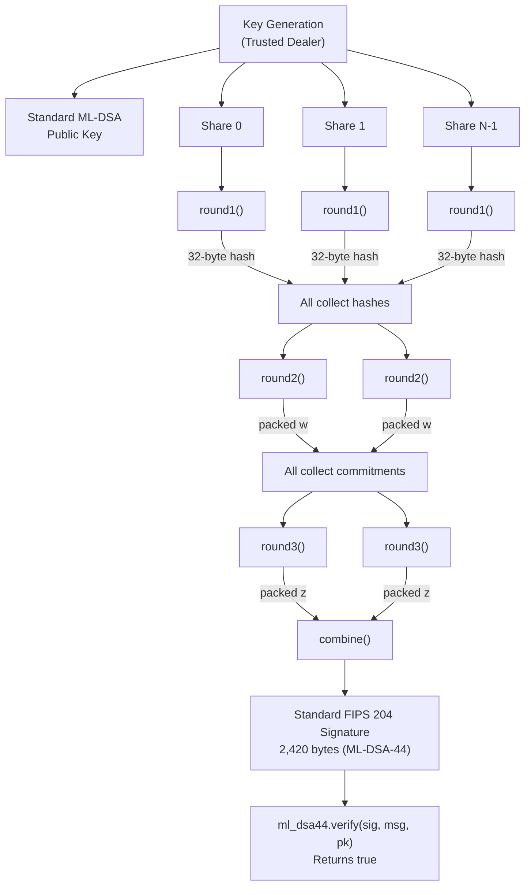

### 7.2 Key Insight: Hyperball Masking

Instead of sampling y uniformly from [-γ₁+1, γ₁]^{N·L} as in standard ML-DSA, the threshold protocol:

1. Samples a point on a high-dimensional hypersphere (radius r') using Box-Muller + normalization
2. Rounds to get integer vectors (y, e)
3. Computes w = A·y + e (instead of w = A·y)

This continuous sampling enables additive sharing: each party samples independently on the hypersphere, and the sum of their samples is also "well-shaped" enough to pass the norm checks after rounding.

### 7.3 Additive Secret Sharing

The secret key (s₁, s₂) is split into additive shares:

```
s₁ = s₁^{(1)} + s₁^{(2)} + ... + s₁^{(T)}  (mod q)
s₂ = s₂^{(1)} + s₂^{(2)} + ... + s₂^{(T)}  (mod q)
```

But this is (T,T) sharing. For (T,N) sharing, we need any T parties to reconstruct. The paper uses a combinatorial approach: for each subset of (N-T+1) potentially honest signers, generate a separate additive share. Each party stores shares for all subsets they belong to. A "share recovery" algorithm then combines the right shares based on which T parties are active.

---

## 8. Key Generation: Trusted Dealer DKG

### 8.1 Step-by-Step Walkthrough: Generating a 3-of-5 Threshold Multisig

Here is exactly what happens, word for word, when you create a threshold multisig account:

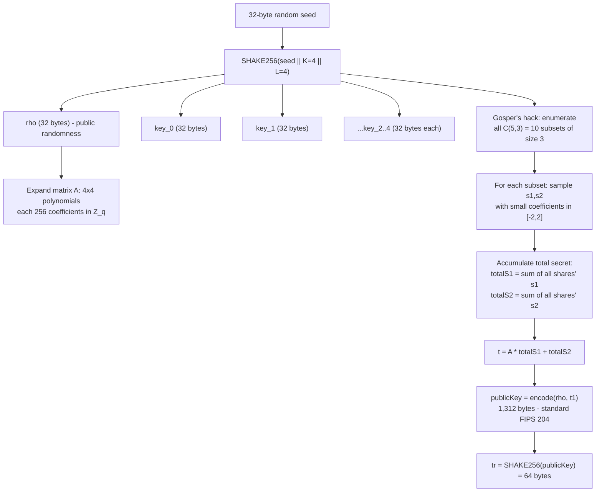

**Step 1: The dealer generates a 32-byte random seed.**

This is the only source of randomness. Everything else is deterministic from this seed. The seed is fed into SHAKE256 (an extendable output function — a hash that can produce unlimited output).

**Step 2: SHAKE256 expands the seed.**

First 32 bytes of output → `rho` (the public randomness that determines the matrix A). Then 5 × 32 bytes → one `key` per party (per-party randomness for future use).

**Step 3: The public matrix A is expanded from rho.**

A is a 4×4 matrix of polynomials (for ML-DSA-44). Each polynomial has 256 coefficients in Z_q (where q = 8,380,417). This matrix is public — it's embedded in the public key via `rho`. The expansion uses XOF-128 (SHAKE-128) with rejection sampling to ensure uniform distribution.

**Step 4: Gosper's hack enumerates all subsets of 3 honest signers out of 5.**

For T=3, N=5, we need N−T+1 = 3 signers in each honest subset. There are C(5,3) = 10 such subsets. Each subset is a 5-bit bitmask:
- `00111` (parties 0,1,2), `01011` (parties 0,1,3), `01101` (parties 0,2,3), `01110` (parties 1,2,3)
- `10011` (parties 0,3,4), `10101` (parties 1,3,4), `10110` (parties 2,3,4), `11001` (parties 0,3,4)
- `11010` (parties 1,3,4), `11100` (parties 2,3,4)

Gosper's hack iterates through all these bitmasks in ascending order using bitwise arithmetic:

```typescript
let honestSigners = (1 << (N - T + 1)) - 1;  // smallest with 3 bits set
while (honestSigners < (1 << N)) {
  // Process this subset...
  const c = honestSigners & -honestSigners;     // lowest set bit
  const r = honestSigners + c;                  // carry propagation
  honestSigners = (((r ^ honestSigners) >> 2) / c) | r;
}
```

**Why integer division works**: In Go, `(r ^ honestSigners) >> 2 / c` uses integer division. In JavaScript, `/` produces a float, but for N <= 6, all intermediate values fit in 32-bit integers, and `| r` truncates to integer. The maximum value of the numerator is bounded by 2^N < 2^6 = 64, so the division is exact.

**Step 5: For each honest-signer subset, sample a secret share.**

The SHAKE256 stream produces a 64-byte share seed for each subset. From this seed, `deriveUniformLeqEta` samples:
- s₁: 4 polynomials (L=4), each with 256 coefficients in [-2, 2] (for η=2)
- s₂: 4 polynomials (K=4), same range

These are tiny coefficients — the security of ML-DSA depends on the secret having small coefficients. Each share's secret is distributed to every party whose bit is set in the subset bitmask.

**Step 6: Accumulate the total secret.**

All 10 shares' s₁ vectors are summed (mod q) to get totalS₁. Same for s₂. This total secret is what a standard ML-DSA key generation would produce. No single party knows it — each party only knows the shares for subsets they belong to.

**Step 7: Compute the public key.**

```
t = A · NTT(totalS₁) + totalS₂     // multiplication in NTT domain, then inverse NTT
(t₁, t₀) = Power2Round(t)           // split into high and low bits
publicKey = encode(rho, t₁)          // standard FIPS 204 format: 1312 bytes
tr = SHAKE256(publicKey, 64)         // public key hash
```

The resulting public key is **byte-for-byte identical in format** to a single-signer ML-DSA-44 public key. Nobody can tell it's a threshold key.

**Step 8: Distribute shares.**

Each of the 5 parties receives their ThresholdKeyShare:
- Party 0 gets shares for all subsets containing bit 0 (6 out of 10 subsets)
- Party 1 gets shares for all subsets containing bit 1 (6 out of 10 subsets)
- etc.

The dealer then **destroys the seed and all intermediate data**. After this point, no single entity holds the full secret.

**Result: One standard ML-DSA public key (the OPNet address) + 5 key shares (one per party). Any 3 can sign.**

### 8.2 Seed Expansion

Key generation starts from a 32-byte seed:

```
H = SHAKE256(seed || K || L)      // K, L are ML-DSA dimensions
rho = H.squeeze(32)               // public randomness for A
key_i = H.squeeze(32) for i=0..N-1  // per-party randomness
```

The `||` denotes concatenation. Appending K and L as single bytes matches FIPS 204's key generation domain separation.

### 8.3 Matrix Expansion

The public matrix A ∈ R_q^{K×L} is expanded from ρ:

```
A[i][j] = RejNTTPoly(XOF128(ρ, j, i))    for 0 <= i < K, 0 <= j < L
```

Note the (j, i) order — this matches FIPS 204 exactly. A is in NTT domain and never leaves it.

### 8.4 deriveUniformLeqEta

This function mirrors Go's `PolyDeriveUniformLeqEta`. It uses SHAKE-256 (not SHAKE-128 as in standard ML-DSA's `RejBoundedPoly`) with a 66-byte input:

```
input = seed[0:64] || nonce_le16
```

For η=2: each nibble t < 15 yields coefficient `Q + η - (t - floor(205·t/1024)·5)`. The magic constant `floor(205·t/1024)` computes `floor(t/5)` without division for t < 15.

For η=4: each nibble t <= 2η yields coefficient `Q + η - t`.

The output coefficients are in [0, q) (positive representatives of [-η, η] mod q).

### 8.5 Public Key Computation

After accumulating all shares:

```
totalS1 = Σ s1^{(hs)} mod q    (sum over all honest-signer subsets)
totalS2 = Σ s2^{(hs)} mod q

t = A · NTT(totalS1) + totalS2    (compute in normal domain after InvNTT)
(t1, t0) = Power2Round(t)
pk = publicCoder.encode(ρ, t1)
tr = SHAKE256(pk, 64 bytes)        // public key hash
```

The public key `pk` is identical in format to a standard FIPS 204 public key. Any ML-DSA verifier can use it.

### 8.6 Share Distribution

Each party i receives:
- `id`: party index (0-based)
- `rho`: shared public seed (32 bytes)
- `key`: per-party randomness (32 bytes)
- `tr`: public key hash (64 bytes)
- `shares`: Map from bitmask → (s1, s2, s1Hat, s2Hat) for all subsets containing party i

After distributing shares securely, the dealer MUST erase the seed and all key material. Secure channels (TLS, noise protocol, physical delivery) should be used for distribution.

---

## 9. Hyperball Sampling

### 9.1 Motivation

In standard ML-DSA, the masking vector y is sampled uniformly from [-γ₁+1, γ₁]^{N·L}. This works for single-signer because the signer knows the full secret and can perform rejection sampling locally.

In threshold ML-DSA, each party independently samples a "partial masking" vector. These must:
1. Sum to something that looks like a valid masking vector
2. Not leak information about individual parties' secrets
3. Enable efficient rejection sampling (not too many rejections)

The hyperball construction achieves this by sampling from a continuous distribution on a high-dimensional sphere, then rounding to integers.

### 9.2 Algorithm: sampleHyperball

**Input**: radius r', scaling factor ν, dimensions (K, L), seed rhop (64 bytes), nonce

**Output**: Float64Array of dimension N·(K+L)

```
dim = N · (K + L)         // e.g., 256 · 8 = 2048 for ML-DSA-44
numSamples = dim + 2      // need even number for Box-Muller pairs

1. Initialize SHAKE256 with domain separator:
   H = SHAKE256('H' || rhop || nonce_le16)

2. Generate numSamples random floats via Box-Muller:
   bytes = H.squeeze(numSamples * 8)
   for i = 0, 2, 4, ..., numSamples-2:
     (f1, f2) = uniformFloats(bytes[i*8 .. (i+2)*8])
     if f1 == 0: f1 = MIN_VALUE           // C1 fix
     z1 = sqrt(-2·ln(f1)) · cos(2π·f2)    // Box-Muller
     z2 = sqrt(-2·ln(f1)) · sin(2π·f2)
     samples[i] = z1; samples[i+1] = z2
     sq += z1² + z2²                       // L2 norm accumulation
     if i < N·L: samples[i] *= ν           // scale L-components
     if i+1 < N·L: samples[i+1] *= ν

3. Normalize to sphere of radius r':
   factor = r' / sqrt(sq)
   result[0..dim-1] = samples[0..dim-1] * factor
```

### 9.3 Box-Muller Transform

The Box-Muller transform converts two independent uniform random variables U₁, U₂ ∈ (0, 1) into two independent standard normal variables:

```
Z₁ = √(-2 ln U₁) · cos(2π U₂)
Z₂ = √(-2 ln U₁) · sin(2π U₂)
```

**Why Box-Muller?** It produces exact standard normal samples (no approximation) and generates them in pairs, which is efficient for our high-dimensional sampling. The hyperball construction samples from the surface of a sphere by:
1. Generating dim+2 standard normal samples (need even count for pairing)
2. Normalizing their L2 norm to radius r'

This works because the projection of a multivariate standard normal onto the unit sphere is uniformly distributed on that sphere (a well-known result from the theory of spherical distributions).

### 9.4 BigInt Precision for Uniform Floats

Converting 64-bit random bytes to uniform floats in [0, 1) requires care:

**Naive approach (Go)**: `float64(uint64) / (1 << 64)` — this double-rounds because uint64 values above 2^53 cannot be exactly represented as float64.

**Our approach**: Extract exactly 53 bits of precision:

```typescript
const u: bigint = dataView.getBigUint64(offset, true);   // full 64-bit value
const f: number = Number(u >> 11n) * TWO_NEG_53;          // exactly 53 bits
// TWO_NEG_53 = 2^(-53) = 1.1102230246251565e-16 (exact in float64)
```

**Why `>> 11n`?** Shifting right by 11 bits extracts the top 53 bits of the 64-bit value. Since Number.MAX_SAFE_INTEGER = 2^53 - 1, the result of `Number(u >> 11n)` is always exactly representable. Multiplying by 2^(-53) (which is exact in float64) gives a uniform value in [0, 1 - 2^(-53)].

**Comparison to Go**: Go uses `float64(binary.LittleEndian.Uint64(b)) / (1 << 64)`. For values above 2^53, the `float64(uint64)` conversion rounds to the nearest representable float, then divides by 2^64. This introduces a double-rounding: first rounding the integer, then the division. Our approach avoids this by working within 53-bit precision throughout. Both approaches produce valid uniform samples; ours is technically more precise.

### 9.5 L2 Norm Accumulation Order

The L2 norm `sq` is accumulated from the **unscaled** Box-Muller samples, including the extra pair beyond `dim`. This matches the Go reference exactly:

```
sq += z1² + z2²    // BEFORE ν scaling
```

After all pairs are generated, the first N·L components are scaled by ν (= 3.0). The scaling happens in-place:

```
if i < N·L:  samples[i] *= ν
```

The `sq` value (computed from unscaled samples) is used for normalization:

```
factor = r' / sqrt(sq)
result[i] = samples[i] * factor    // samples already ν-scaled for i < N·L
```

This means the L-dimension components of the result are scaled by ν relative to the K-dimension components. The excess check (`fvecExcess`) accounts for this by dividing L-component squares by ν² when computing the weighted norm.

### 9.6 The C1 Fix: Avoiding log(0)

Box-Muller requires ln(U₁), which is -∞ when U₁ = 0. The probability of U₁ = 0 is 2^(-53) (the smallest representable positive value after our conversion). The fix:

```typescript
const f1 = f1Raw === 0 ? Number.MIN_VALUE : f1Raw;
```

`Number.MIN_VALUE ≈ 5 × 10^(-324)` is the smallest positive denormalized float64. Using it instead of 0 gives a large but finite value for √(-2·ln(MIN_VALUE)) ≈ 38.6. This sample will almost certainly be rejected by the excess check, so it does not affect the distribution in any meaningful way.

---

## 10. Share Recovery

### 10.1 Problem Statement

Given T active parties out of N total, each party must reconstruct their combined secret share (s1Hat, s2Hat) for the specific active set. The key generation distributes shares indexed by honest-signer bitmasks. The share recovery algorithm maps the current active set to the appropriate combination of stored shares.

### 10.2 Sharing Patterns

The sharing patterns are precomputed by `params/recover.py` using a max-flow optimal assignment algorithm. They are stored as lookup tables indexed by (T, N).

Each pattern is an array of arrays: `pattern[i]` lists the bitmasks that party i (in the canonical ordering) must sum to reconstruct their share.

**Example: T=2, N=3**:

```typescript
// pattern = [[3, 5], [6]]
// Party 0: sum shares with bitmasks 3 (=0b011) and 5 (=0b101)
// Party 1: sum share with bitmask 6 (=0b110)
```

### 10.3 Permutation-Based Bitmask Translation

The sharing patterns are defined for a canonical ordering where the first T parties are active. When the actual active set differs, we need a permutation to translate bitmask indices.

```typescript
// Build permutation: active parties get indices 0..T-1, inactive get T..N-1
const perm = new Uint8Array(N);
let i1 = 0;   // index for active parties
let i2 = T;   // index for inactive parties
let currenti = 0; // this party's canonical index

for (let j = 0; j < N; j++) {
  if (j === share.id) currenti = i1;
  if ((act & (1 << j)) !== 0) {
    perm[i1++] = j;   // active party j → canonical index i1
  } else {
    perm[i2++] = j;   // inactive party j → canonical index i2
  }
}
```

Then, for each bitmask `u` in the sharing pattern, translate it through the permutation:

```typescript
let u_ = 0;
for (let i = 0; i < N; i++) {
  if ((u & (1 << i)) !== 0) {
    u_ |= (1 << perm[i]);  // map canonical bit i to actual party perm[i]
  }
}
const s = share.shares.get(u_);  // look up actual share
```

### 10.4 Base Case: T = N

When T = N (all parties required), each party has exactly one share (corresponding to the single C(N,1) = N subset of size 1). No permutation is needed:

```typescript
if (T === N) {
  for (const [, s] of share.shares) {
    return { s1Hat: s.s1Hat.map(x => x.slice()), s2Hat: s.s2Hat.map(x => x.slice()) };
  }
}
```

### 10.5 Share Accumulation

After translation, the party sums all their assigned shares:

```typescript
for (const u of sharing[currenti]) {
  const u_ = translateBitmask(u, perm);
  const s = share.shares.get(u_);
  for (j = 0..L-1): polyAdd(s1Hat[j], s.s1Hat[j])
  for (j = 0..K-1): polyAdd(s2Hat[j], s.s2Hat[j])
}
// Normalize: s1Hat[j][i] = mod(s1Hat[j][i]) for all j, i
// Normalize: s2Hat[j][i] = mod(s2Hat[j][i]) for all j, i
```

The result (s1Hat, s2Hat) is this party's additive share of the full secret (in NTT domain). Summing all T parties' recovered shares gives the full secret:

```
Σ_{active parties} s1Hat_party = totalS1Hat = NTT(totalS1) mod q
```

---

## 11. The 3-Round Distributed Signing Protocol

### 11.1 Overview

The distributed protocol consists of three rounds plus a combine step:

| Round | Communication | Purpose |
|-------|--------------|---------|
| **Round 1** | Broadcast 32-byte hash | Commit to randomness |
| **Round 2** | Broadcast packed w vectors | Reveal commitment |
| **Round 3** | Broadcast packed z vectors | Partial response |
| **Combine** | None (local computation) | Produce FIPS 204 signature |

### 11.2 Step-by-Step Walkthrough: Signing a Transaction

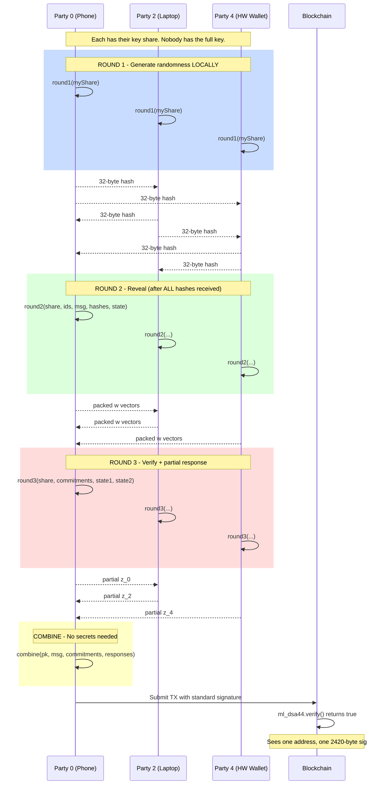

**No party's secret ever leaves their device.** This is exactly how Bitcoin multisig works conceptually: each signer contributes independently, on their own machine, disconnected. But this is post-quantum, and the output is a single standard FIPS 204 signature.

### 11.3 Round 1: Commitment

Each party independently:

1. **Generate randomness**: rhop = random 64 bytes (or user-provided)
2. **Sample K_iter hyperball points**: For iter = 0..K_iter-1:
   ```
   stw[iter] = sampleHyperball(r', ν, K, L, rhop, nonce·K_iter + iter)
   ```
3. **Round to integer vectors**: (y, e) = fvecRound(stw)
4. **Compute commitment**: w = A·NTT(y) + e (in normal domain)
5. **Pack commitments**: pack all K_iter commitment vectors into bytes
6. **Hash commitment**: commitmentHash = SHAKE256(tr || partyId || packedW), 32 bytes

**Output**: {commitmentHash, state}

The commitment hash is broadcast to all parties. The packed commitment data is kept private until Round 2.

**Why commit-then-reveal?** Without this, a malicious party could see others' commitments and choose their own adaptively to manipulate the combined commitment. The hash commitment prevents this: all parties commit before any reveals.

**Commitment hash structure**: `SHAKE256(tr || partyId_byte || packedW)` with `dkLen=32`. The 1-byte party ID (matching the Go reference) binds the commitment to a specific party, preventing replay attacks.

### 11.4 Round 2: Reveal

After receiving all T commitment hashes, each party:

1. **Validate**: Check correct number of hashes, no duplicate party IDs
2. **Store hashes**: Save copies for verification in Round 3
3. **Compute message digest**: μ = SHAKE256(tr || getMessage(msg, ctx)), 64 bytes
4. **Reveal commitment**: Return packed commitment data from Round 1

**Output**: {commitment, state}

### 11.5 Round 3: Partial Response

After receiving all T commitment reveals, each party:

1. **Verify commitments against hashes**: For each party i:
   ```
   expected = SHAKE256(tr || partyId_i || commitment_i), 32 bytes
   if expected ≠ storedHash_i: ABORT
   ```
   Verification uses constant-time comparison (bitwise OR of XOR differences).

2. **Unpack and aggregate commitments**:
   ```
   wfinal[iter][j] = Σ allWs[party][iter][j] mod q
   ```

3. **Recover combined secret share**: (s1Hat, s2Hat) = recoverShare(share, act)

4. **Compute partial response**: For each iter = 0..K_iter-1:
   ```
   w1 = HighBits(wfinal[iter])
   c̃ = SHAKE256(μ || W1Vec.encode(w1))
   ĉ = NTT(SampleInBall(c̃))
   cs1[j] = InvNTT(ĉ · s1Hat[j])
   cs2[j] = InvNTT(ĉ · s2Hat[j])
   csVec = fvecFrom(cs1, cs2)     // convert to float64
   zf = csVec + stw[iter]          // float64 addition
   excess = fvecExcess(zf, r, ν)
   (z, _) = fvecRound(zf)          // ALWAYS executed (H1 fix)
   if excess: z = zero vector
   ```

5. **Pack and return**: packPolys(zs, L, K_iter)

### 11.6 The H1 Timing Fix

The excess check `fvecExcess(zf, r, ν)` reveals whether the current iteration was accepted or rejected. If `fvecRound()` is only called on accepted iterations, the execution time correlates with the rejection pattern, which correlates with the secret key.

**Fix**: Always execute `fvecRound()` regardless of the excess check result:

```typescript
const excess = fvecExcess(zf, params.r, params.nu, K, L);
const { z } = fvecRound(zf, K, L);  // ALWAYS executed

if (excess) {
  // Use zero vector instead, but fvecRound already ran
  zs.push(zeroVector);
} else {
  zs.push(z);
}
```

This ensures constant execution time regardless of the secret-dependent rejection pattern.

---

## 12. Combine: Signature Finalization

### 12.1 Public Operation

The combine step requires only:
- The threshold public key
- The message
- All parties' commitments (from Round 2)
- All parties' responses (from Round 3)

It does NOT require any secret key material. Anyone with the public key can perform this step.

### 12.2 Algorithm

```
1. Compute μ = SHAKE256(SHAKE256(pk, 64) || getMessage(msg, ctx)), 64 bytes
2. Unpack and aggregate commitments:
   wfinal[iter][j] = Σ allWs[party][iter][j] mod q
3. Unpack and aggregate responses:
   zfinal[iter][j] = Σ allZs[party][iter][j] mod q

4. For iter = 0..K_iter-1:
   a. Check ‖zfinal‖∞ < γ₁ - β, skip if fails

   b. Decompose: (w0, w1) = Decompose(wfinal[iter])

   c. Recompute challenge:
      c̃ = SHAKE256(μ || W1Vec.encode(w1)), C_TILDE_BYTES
      ĉ = NTT(SampleInBall(c̃))

   d. Compute Az:
      zNTT = NTT(z)
      Az[i] = Σ_{j} A[i][j] · zNTT[j]   (in NTT domain)

   e. Compute Az - 2^d·c·t₁:
      ct12d[i] = ĉ · NTT(t₁[i] << d)     (in NTT domain)
      result[i] = InvNTT(Az[i] - ct12d[i])

   f. Compute f = result - wfinal:
      f[j][c] = mod(result[j][c] - wfinal[iter][j][c])

   g. Check ‖f‖∞ < γ₂, skip if fails

   h. Compute hint:
      w0pf[j] = mod(w0[j] + f[j])
      (h, hintPop) = MakeHint(w0pf, w1)
      if hintPop > ω: skip

   i. Success! Encode signature:
      σ = sigCoder.encode([c̃, z, h])
      return σ

5. If no iteration succeeded: return null (retry from Round 1)
```

### 12.3 Why This Produces a Valid FIPS 204 Signature

The key identity that makes threshold signing work:

```
Az - c·(t₁·2^d) = A·(Σ y_i + c·Σ s₁_i) - c·(A·Σ s₁_i + Σ s₂_i - Σ t₀_i)·2^d
                 ≈ A·Σ y_i + Σ e_i + c·Σ s₂_i   (approximately)
                 = wfinal + c·s₂                    (approximately)
```

The "approximately" comes from the rounding errors in fvecRound. The hint h corrects for these small differences, exactly as in standard ML-DSA.

The verifier sees:
1. c̃ (challenge hash)
2. z = Σ z_i (aggregate response)
3. h (hint for rounding correction)

It computes w'_approx = Az - c·t₁·2^d, applies UseHint(h, w'_approx) to get w'₁, and checks that H(μ || W1Encode(w'₁)) = c̃. This is identical to standard FIPS 204 verification.

### 12.4 Protection of t₁

When computing `NTT(polyShiftl(t1[i]))`, the `polyShiftl` operation modifies the polynomial in-place (left-shifts each coefficient by d=13 bits). To prevent corrupting the decoded public key data, we operate on a copy:

```typescript
const ct12d = p.MultiplyNTTs(
  p.NTT.encode(p.polyShiftl(t1[i].slice() as Int32Array)),  // .slice() protects t1
  cHat
);
```

---

## 13. Polynomial Packing: 23-Bit Encoding

### 13.1 Purpose

The distributed protocol needs to transmit full R_q polynomials (coefficients in [0, q)) between parties. Since q = 8,380,417 < 2^23, each coefficient requires exactly 23 bits.

### 13.2 Encoding: polyPackW

```
Input:  Int32Array[256] with values in [0, 2^23)
Output: Uint8Array[736]  (256 × 23 / 8 = 736 bytes)

Algorithm (bit-packing):
  v = 0, j = 0
  for each coefficient p[i]:
    v |= (p[i] & 0x7FFFFF) << j     // append 23 bits
    j += 23
    while j >= 8:                     // flush complete bytes
      buf[k++] = v & 0xFF
      v >>>= 8
      j -= 8
```

### 13.3 Decoding: polyUnpackW

```
Input:  Uint8Array[736]
Output: Int32Array[256] with values in [0, q)

Algorithm (bit-unpacking):
  v = 0, j = 0 (bit accumulator and bit count)
  for each output coefficient:
    while j < 23:                     // need 23 bits
      v += buf[k++] << j
      j += 8
    coeff = v & ((1 << 23) - 1)       // extract 23 bits
    if coeff >= Q: throw Error         // M7 fix: validate
    v >>>= 23
    j -= 23
```

**M7 fix**: The unpacking validates that each coefficient is in [0, q). This prevents an adversary in a distributed protocol from injecting malformed polynomials with coefficients >= q, which could lead to undefined behavior in subsequent ring arithmetic.

### 13.4 Bit Safety

All intermediate values in the packing/unpacking fit within 32-bit integers:

- Maximum accumulator value during packing: `v = coeff << j` where coeff < 2^23 and j < 8, so v < 2^31. The `>>>` operator ensures unsigned right shift.
- Maximum accumulator value during unpacking: `v = byte << j` where byte < 2^8 and j < 23, so v < 2^31.

No 53-bit overflow is possible.

### 13.5 Polynomial Array Packing

For the distributed protocol, we pack/unpack arrays of K_iter × dim polynomials:

```
packPolys(polys, dim, K_iter):
  total bytes = K_iter × dim × 736
  for iter = 0..K_iter-1:
    for j = 0..dim-1:
      polyPackW(polys[iter][j], buf, (iter×dim + j) × 736)

unpackPolys(buf, dim, K_iter):
  validate: buf.length === K_iter × dim × 736
  for iter = 0..K_iter-1:
    for j = 0..dim-1:
      polyUnpackW(result[iter][j], buf, (iter×dim + j) × 736)
```

**Commitment size** = K_iter × K × 736 bytes (e.g., 2 × 4 × 736 = 5,888 bytes for ML-DSA-44, 2-of-2)
**Response size** = K_iter × L × 736 bytes (e.g., 2 × 4 × 736 = 5,888 bytes for ML-DSA-44, 2-of-2)

---

## 14. Parameter Tables

### 14.1 ML-DSA-44 (K=4, L=4, NIST Level 2)

| T\N | 2 | 3 | 4 | 5 | 6 |
|-----|---|---|---|---|---|
| **2** | K=2, r=252778, r'=252833 | K=3, r=310060, r'=310138 | K=3, r=305919, r'=305997 | K=3, r=285363, r'=285459 | K=4, r=300265, r'=300362 |
| **3** | — | K=4, r=246490, r'=246546 | K=7, r=279235, r'=279314 | K=14, r=282800, r'=282912 | K=19, r=277014, r'=277139 |
| **4** | — | — | K=8, r=243463, r'=243519 | K=30, r=259427, r'=259526 | K=74, r=268705, r'=268831 |
| **5** | — | — | — | K=16, r=239924, r'=239981 | K=100, r=250590, r'=250686 |
| **6** | — | — | — | — | K=37, r=219245, r'=219301 |

### 14.2 ML-DSA-65 (K=6, L=5, NIST Level 3)

| T\N | 2 | 3 | 4 | 5 | 6 |
|-----|---|---|---|---|---|
| **2** | K=2, r=344000, r'=344080 | K=3, r=421700, r'=421810 | K=3, r=416000, r'=416110 | K=3, r=388000, r'=388130 | K=4, r=408300, r'=408430 |
| **3** | — | K=4, r=335200, r'=335290 | K=7, r=379600, r'=379710 | K=14, r=384600, r'=384750 | K=19, r=376700, r'=376870 |
| **4** | — | — | K=8, r=331000, r'=331090 | K=30, r=352800, r'=352940 | K=74, r=365400, r'=365570 |
| **5** | — | — | — | K=16, r=326200, r'=326280 | K=100, r=340700, r'=340830 |
| **6** | — | — | — | — | K=37, r=298000, r'=298080 |

### 14.3 ML-DSA-87 (K=8, L=7, NIST Level 5)

| T\N | 2 | 3 | 4 | 5 | 6 |
|-----|---|---|---|---|---|
| **2** | K=2, r=442000, r'=442100 | K=3, r=541600, r'=541740 | K=3, r=534200, r'=534340 | K=3, r=498200, r'=498370 | K=4, r=524300, r'=524470 |
| **3** | — | K=4, r=430600, r'=430710 | K=7, r=487500, r'=487640 | K=14, r=494200, r'=494400 | K=19, r=483600, r'=483820 |
| **4** | — | — | K=8, r=425100, r'=425210 | K=30, r=453300, r'=453470 | K=74, r=469200, r'=469420 |
| **5** | — | — | — | K=16, r=419100, r'=419210 | K=100, r=437400, r'=437570 |
| **6** | — | — | — | — | K=37, r=382800, r'=382910 |

### 14.4 Parameter Interpretation

- **K_iter** (labeled K in tables): Number of parallel signing iterations per round. Higher values increase communication cost but reduce the probability of full protocol restart.
- **r**: Primary L2 radius bound for `fvecExcess`. The combined vector must have weighted L2 norm <= r.
- **r'** (rPrime): Sampling hypersphere radius. Slightly larger than r to account for rounding.
- **ν** (nu): Scaling factor for L-dimension components. Always 3.0.

### 14.5 Parameter Scaling

Parameters scale with lattice dimensions:
- r and r' grow approximately proportionally to √(N·(K+L))
- K_iter grows rapidly with T and N, reflecting the combinatorial explosion of potential failure modes
- ML-DSA-44 values are exact from Go reference; ML-DSA-65/87 values are derived using the same formulas scaled for their respective dimensions

---

## 15. Security Analysis and Hardening

### 15.1 Applied Audit Findings

The following findings from the threshold ML-DSA audit report have been addressed:

#### C1 (Critical): Box-Muller NaN/Infinity from log(0)

**Vulnerability**: When U₁ = 0 (probability 2^(-53)), `Math.log(0) = -Infinity`, causing NaN propagation.

**Fix**: Clamp to `Number.MIN_VALUE`:
```typescript
const f1 = f1Raw === 0 ? Number.MIN_VALUE : f1Raw;
```

#### C8 (Critical): No input validation on publicKey/msg

**Vulnerability**: Passing wrong-length or undefined values to `sign()` could cause silent misbehavior — wrong polynomial sizes, buffer overflows, or silently incorrect signatures.

**Fix**: `abytes()` length checks on both inputs:
```typescript
abytes(publicKey, p.publicCoder.bytesLen, 'publicKey');
abytes(msg);
```

#### H1 (High): Timing leak from rejection pattern

**Vulnerability**: The accept/reject decision in `computeResponses` depends on the secret key (via csVec). If `fvecRound()` is only called on accepted iterations, the execution time reveals the rejection pattern, which in turn correlates with the secret key.

**Fix**: Always execute `fvecRound()`:
```typescript
const excess = fvecExcess(zf, params.r, params.nu, K, L);
const { z } = fvecRound(zf, K, L);  // Always executed
if (excess) { zs.push(zeroVector); } else { zs.push(z); }
```

#### H6 (High): No zeroization of secret key material

**Vulnerability**: Secret shares, intermediate products (c·s₁, c·s₂), and the message digest μ remain in memory after use. An attacker with memory access could extract signing keys.

**Fix**: Explicit zeroization on both success and failure paths:
```typescript
// After each iteration:
csVec.fill(0);
zf.fill(0);
cleanBytes(cs1, cs2);

// After all iterations:
cleanBytes(s1Hat, s2Hat);  // recovered share

// In sign():
mu.fill(0);  // message digest
for (const stws of allStws) for (const stw of stws) stw.fill(0);
for (const zs of allZs) for (const z of zs) cleanBytes(z);
```

#### M7 (Medium): No validation on unpacked polynomial coefficients

**Vulnerability**: In a distributed protocol, a malicious party could send polynomials with coefficients >= q, leading to undefined behavior in ring arithmetic. This is especially dangerous because the distributed protocol receives untrusted polynomial data from other parties.

**Fix**: Bounds check in `polyUnpackW`:
```typescript
const coeff = v & ((1 << 23) - 1);
if (coeff >= Q) throw new Error(`Invalid polynomial coefficient: ${coeff} >= Q`);
```

### 15.2 Additional Hardening

#### Duplicate Share ID Validation

If two shares have the same party ID, the bitmask construction in share recovery produces incorrect results silently. We validate uniqueness:

```typescript
let act = 0;
for (const share of activeShares) {
  const bit = 1 << share.id;
  if (act & bit) throw new Error(`Duplicate share ID: ${share.id}`);
  act |= bit;
}
```

#### Commitment Hash Verification (Constant-Time)

In round3, commitment hashes are verified using constant-time comparison to prevent timing-based attacks:

```typescript
let diff = 0;
for (let j = 0; j < expected.length; j++) diff |= expected[j] ^ hashes[i][j];
if (diff !== 0) throw new Error(`Commitment hash mismatch for party ${activePartyIds[i]}`);
```

#### State Destruction

Round1State and Round2State classes use `#private` fields and provide `destroy()` methods that zero sensitive data:

```typescript
class Round1State {
  readonly #stws: Float64Array[];   // hyperball samples (secret)
  #destroyed: boolean;

  destroy(): void {
    if (!this.#destroyed) {
      for (const stw of this.#stws) stw.fill(0);
      this.#destroyed = true;
    }
  }
}
```

After destruction, any access to `_stws` or `_commitment` throws an error.

#### Failure-Path Cleanup

The message digest μ is zeroed even when all 500 signing attempts are exhausted:

```typescript
// In sign():
try {
  for (let attempt = 0; attempt < 500; attempt++) { ... }
} finally {
  mu.fill(0);  // Always executed
}
```

---

## 16. Float64 Precision Analysis

### 16.1 Where Float64 is Used

Float64 (IEEE 754 double precision) is used exclusively in hyperball sampling and the FVec operations:

1. **sampleHyperball**: Box-Muller transform produces Float64 Gaussian samples
2. **fvecFrom**: Converts Int32 ring elements to Float64 (centered mod q)
3. **fvecAdd**: Adds two Float64 vectors
4. **fvecExcess**: Computes weighted L2 norm (Float64 arithmetic)
5. **fvecRound**: Rounds Float64 back to Int32

### 16.2 Ring Arithmetic: Always Int32

All ring operations (polyAdd, polySub, MultiplyNTTs, NTT encode/decode, etc.) use Int32Array and stay within safe integer range:

- Maximum coefficient value: q-1 = 8,380,416 (23 bits)
- Maximum product: (q-1)^2 ≈ 7.02 × 10^13 (47 bits) — within 53-bit safe range
- Maximum sum: bounded by q after mod reduction

This means all cryptographic ring arithmetic is exact. Float64 is only used for the continuous-distribution sampling, which is inherently approximate and tolerant of platform-dependent rounding.

### 16.3 fvecFrom: Centered Mod Q

Converting ring elements to Float64:

```typescript
u = s[i][j] | 0;                     // ensure int32
u = ((u + ((Q - 1) / 2)) | 0) % Q;  // shift by (Q-1)/2
if (u < 0) u += Q;
u = u - ((Q - 1) / 2);              // center: result in [-(Q-1)/2, (Q-1)/2]
result[i * N + j] = u;               // lossless int → float64
```

The maximum absolute value is (Q-1)/2 = 4,190,208 (23 bits). This is exactly representable in Float64 (which has 53 bits of mantissa), so the conversion is lossless.

### 16.4 Platform Dependence

The functions `Math.sqrt`, `Math.cos`, `Math.sin`, `Math.log` may differ by 1 ULP (Unit in the Last Place) across platforms, architectures, or JavaScript engines. This means:

- Two implementations running on different platforms may produce different hyperball samples from the same seed
- Each platform's samples are independently valid (they pass the norm checks)
- Cross-platform deterministic signing (identical bit-for-bit signatures from the same inputs) is NOT guaranteed

This is acceptable because:
1. The protocol's security does not depend on deterministic sampling — it depends on the statistical properties of the distribution
2. Each platform produces valid FIPS 204 signatures that verify correctly
3. The rejection sampling loop handles minor distribution differences

### 16.5 fvecRound Precision

The rounding step converts Float64 back to Int32:

```typescript
let u = Math.round(v[i * N + j]) | 0;
if (u < 0) u += Q;
```

`Math.round` rounds to the nearest integer, with ties going to +∞ (round-half-up). The `| 0` truncates to int32. Since the Float64 values from fvecFrom are bounded by ±4,190,208 and the hyperball radius bounds are on the order of 250,000-550,000, the rounded values easily fit in int32.

---

## 17. Architecture and Implementation

### 17.1 Module Structure

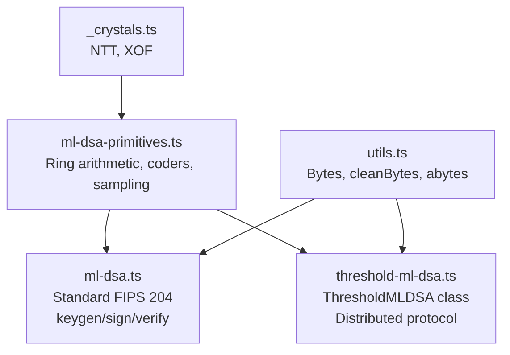

### 17.2 Primitives Extraction

The `createMLDSAPrimitives(opts)` factory in `ml-dsa-primitives.ts` extracts shared functionality from the `getDilithium` closure. This enables code reuse without modifying the existing ML-DSA API:

```
                    createMLDSAPrimitives(opts)
                           │
                    ┌──────┴──────┐
                    ▼              ▼
              getDilithium    ThresholdMLDSA
              (ml-dsa.ts)    (threshold-ml-dsa.ts)
```

The primitives include:
- Ring arithmetic: mod, smod, polyAdd, polySub, polyShiftl, polyChknorm, MultiplyNTTs
- NTT: encode (forward NTT), decode (inverse NTT)
- Sampling: RejNTTPoly, RejBoundedPoly, SampleInBall
- Decomposition: decompose, HighBits, LowBits, MakeHint, UseHint, Power2Round
- Polynomial helpers: polyPowerRound, polyUseHint, polyMakeHint
- Coders: ETACoder, T0Coder, T1Coder, ZCoder, W1Coder, W1Vec, hintCoder, sigCoder, publicCoder, secretCoder
- Constants: K, L, N, Q, D, GAMMA1, GAMMA2, TAU, ETA, OMEGA, BETA, etc.

### 17.3 Class Design

```typescript
class ThresholdMLDSA {
  // Static
  static readonly MAX_PARTIES = 6;
  static create(securityLevel, T, N): ThresholdMLDSA;
  static getParams(T, N, securityLevel): ThresholdParams;

  // Instance
  readonly #primitives: MLDSAPrimitives;
  readonly params: ThresholdParams;

  // Public API
  keygen(seed?): ThresholdKeygenResult;
  sign(msg, publicKey, shares, opts?): Uint8Array;     // local convenience
  round1(share, opts?): Round1Result;                    // distributed
  round2(share, activePartyIds, msg, hashes, state, opts?): Round2Result;
  round3(share, commitments, state1, state2): Uint8Array;
  combine(publicKey, msg, commitments, responses, opts?): Uint8Array | null;

  // Private
  #deriveUniformLeqEta(seed, nonce): Int32Array;
  #recoverShare(share, act): { s1Hat, s2Hat };
  #genCommitment(share, rhop, nonce, params): { ws, stws };
  #aggregateCommitments(allWs, params): Int32Array[][];
  #hashCommitment(tr, partyId, commitment): Uint8Array;
  #computeResponses(share, act, mu, wfinals, stws, params): Int32Array[][];
  #aggregateResponses(allZs, params): Int32Array[][];
  #combine(publicKey, mu, wfinals, zfinals, params): Uint8Array | null;
}
```

### 17.4 State Management

The distributed protocol requires state to be carried between rounds:

**Round1State**: Contains:
- `#stws: Float64Array[]` — hyperball samples (K_iter vectors, each of dimension N·(K+L)). These are the continuous masking values that will be combined with the secret in Round 3. **Sensitive**: must be destroyed after use.
- `#commitment: Uint8Array` — packed w vectors. Not secret but needed for Round 2 reveal.

**Round2State**: Contains:
- `#hashes: Uint8Array[]` — stored commitment hashes from all parties (for verification in Round 3)
- `#mu: Uint8Array` — message digest. **Sensitive**: must be destroyed after use.
- `#act: number` — active signer bitmask
- `#activePartyIds: number[]` — ordered list of active party IDs

Both classes use `#private` fields (ES2022 hard private) ensuring no external access, and provide `destroy()` methods for explicit zeroization.

### 17.5 FVec Layout

A Float64Array of size N·(K+L) representing a vector in R_q^{K+L}:

```
[  poly_0   |  poly_1   | ... | poly_{L-1} | poly_L  | ... | poly_{L+K-1} ]
  ← L polynomials (z/y components) →         ← K polynomials (e components) →
  coefficients 0..N-1 of each polynomial
```

- First N·L floats: the "z" (response) or "y" (masking) components
- Last N·K floats: the "e" (error) components
- Total: N·(K+L) = 256·8 = 2048 floats for ML-DSA-44

The L-components are scaled by ν=3.0 during hyperball sampling, and the weighted norm check in fvecExcess divides their squares by ν² to compensate.

---

## 18. API Reference

### 18.1 ThresholdMLDSA.create(securityLevel, T, N)

**Factory method** creating a configured ThresholdMLDSA instance.

| Parameter | Type | Description |
|-----------|------|-------------|
| securityLevel | number | 44, 65, 87 (or 128, 192, 256) |
| T | number | Threshold (minimum signers), 2 <= T |
| N | number | Total parties, T <= N <= 6 |

```typescript
const th = ThresholdMLDSA.create(44, 3, 5); // 3-of-5, ML-DSA-44
```

### 18.2 ThresholdMLDSA.getParams(T, N, securityLevel)

**Static method** returning threshold parameters without creating a full instance.

**Returns**: `ThresholdParams { T, N, K_iter, nu, r, rPrime }`

### 18.3 keygen(seed?)

**Trusted dealer key generation**. Produces a standard FIPS 204 public key and N threshold key shares.

| Parameter | Type | Description |
|-----------|------|-------------|
| seed | Uint8Array(32)? | Optional deterministic seed (default: random) |

**Returns**: `ThresholdKeygenResult { publicKey, shares }`

```typescript
const { publicKey, shares } = th.keygen();
// publicKey: standard FIPS 204 public key (1312/1952/2592 bytes)
// shares: N ThresholdKeyShare objects
```

### 18.4 sign(msg, publicKey, shares, opts?)

**Local convenience method**. Runs the full 3-round protocol locally.

| Parameter | Type | Description |
|-----------|------|-------------|
| msg | Uint8Array | Message to sign |
| publicKey | Uint8Array | Threshold public key |
| shares | ThresholdKeyShare[] | At least T shares |
| opts.context | Uint8Array? | Optional FIPS 204 context (max 255 bytes) |

**Returns**: `Uint8Array` — standard FIPS 204 signature (2,420 / 3,309 / 4,627 bytes)

```typescript
const sig = th.sign(message, publicKey, [shares[0], shares[2], shares[4]]);
const valid = ml_dsa44.verify(sig, message, publicKey); // true
```

### 18.5 round1(share, opts?)

**Distributed Round 1**: Generate commitment.

| Parameter | Type | Description |
|-----------|------|-------------|
| share | ThresholdKeyShare | This party's key share |
| opts.nonce | number? | Attempt counter (default 0) |
| opts.rhop | Uint8Array(64)? | Randomness (default: random) |

**Returns**: `Round1Result { commitmentHash, state }`

- `commitmentHash` (32 bytes): broadcast to all parties
- `state` (Round1State): keep private, pass to round2/round3, call `destroy()` when done

### 18.6 round2(share, activePartyIds, msg, round1Hashes, round1State, opts?)

**Distributed Round 2**: Store hashes, compute message digest, reveal commitment.

| Parameter | Type | Description |
|-----------|------|-------------|
| share | ThresholdKeyShare | This party's key share |
| activePartyIds | number[] | IDs of all T participating parties |
| msg | Uint8Array | Message to sign |
| round1Hashes | Uint8Array[] | 32-byte hashes from all parties |
| round1State | Round1State | State from round1() |
| opts.context | Uint8Array? | Optional context |

**Returns**: `Round2Result { commitment, state }`

- `commitment` (Uint8Array): broadcast to all parties
- `state` (Round2State): keep private, pass to round3, call `destroy()` when done

### 18.7 round3(share, commitments, round1State, round2State)

**Distributed Round 3**: Verify commitments, compute partial response.

| Parameter | Type | Description |
|-----------|------|-------------|
| share | ThresholdKeyShare | This party's key share |
| commitments | Uint8Array[] | Packed commitments from all parties (same order as activePartyIds) |
| round1State | Round1State | State from round1() |
| round2State | Round2State | State from round2() |

**Returns**: `Uint8Array` — packed partial response, broadcast to all parties

**Throws**: If any commitment doesn't match its hash from round1.

### 18.8 combine(publicKey, msg, commitments, responses, opts?)

**Combine step**: Produce standard FIPS 204 signature from aggregated data. Does NOT require any secret key material.

| Parameter | Type | Description |
|-----------|------|-------------|
| publicKey | Uint8Array | Threshold public key |
| msg | Uint8Array | Message that was signed |
| commitments | Uint8Array[] | Packed commitments from all parties |
| responses | Uint8Array[] | Packed responses from all parties |
| opts.context | Uint8Array? | Optional context (must match round2) |

**Returns**: `Uint8Array | null` — FIPS 204 signature, or null (retry from round1)

### 18.9 commitmentByteLength / responseByteLength

```typescript
th.commitmentByteLength  // K_iter × K × 736
th.responseByteLength    // K_iter × L × 736
```

---

## 19. Known Limitations

### 19.1 No Side-Channel Protection

This implementation inherits the side-channel characteristics of noble-post-quantum. JavaScript cannot guarantee constant-time operations:

- Branch misprediction from if/else on secret-dependent values
- Cache-timing attacks on array indexing
- JIT compiler optimizations may introduce timing variations
- Garbage collector pauses may be correlated with memory allocation patterns

The H1 fix (always executing fvecRound) addresses one specific timing leak, but comprehensive side-channel protection requires hardware-level guarantees that JavaScript cannot provide.

### 19.2 Float64 Platform Dependence

Transcendental functions (`Math.sqrt`, `Math.cos`, `Math.sin`, `Math.log`) are not required to be correctly rounded by IEEE 754. Different platforms may produce results differing by 1 ULP. This means:

- Cross-platform deterministic signing is NOT guaranteed
- Each platform independently produces valid signatures
- Test vectors may not be portable across architectures

### 19.3 Trusted Dealer Keygen

`keygen()` generates all shares in one place (trusted dealer model). The dealer sees the full secret during key generation. For environments requiring no trusted dealer:

1. Use an external MPC protocol to generate the 32-byte seed collaboratively, then pass it to `keygen()` on an air-gapped machine
2. Physically destroy the air-gapped machine after share distribution
3. A fully distributed DKG protocol — where each party generates their own contribution and nobody ever sees the full secret — is theoretically possible for lattice-based schemes but remains an active area of research. It would require verifiable secret sharing over polynomial rings, which adds significant protocol complexity beyond the current signing protocol.

### 19.4 Identifiable Aborts

The current implementation supports identifiable abort detection implicitly (commitment hash verification in round3 catches cheating parties), but does not expose a standalone `identifyAbort()` method. If a signing attempt fails:

- The protocol retries from Round 1 with fresh randomness
- The local `sign()` method retries up to 500 times
- No explicit identification of which party caused the failure

### 19.5 Maximum 6 Parties

N is limited to 6 because:
- The share recovery tables are precomputed for N <= 6
- The number of honest-signer subsets C(N, N-T+1) grows rapidly (e.g., C(6,5) = 6, but C(10,5) = 252)
- Parameter tables (K_iter, r, r') are empirically optimized for N <= 6
- K_iter grows rapidly with T and N — for (T=5, N=6), K_iter = 100, meaning 100 parallel signing attempts per round
- Larger N would require new parameter derivation, validation, and significantly more communication bandwidth per round

The **signature size never changes** regardless of N — it's always standard FIPS 204. But the off-chain communication during signing grows with K_iter. Beyond N=6, this communication becomes impractical for interactive signing.

### 19.6 Unaudited Implementation

This is a port of an academic reference implementation. It has NOT undergone formal security audit. The Go reference implementation's audit findings have been applied, but the TypeScript port itself is unaudited. Do not use for production custody without formal review.

---

## Appendix A: Notation Reference

| Symbol | Meaning |
|--------|---------|
| R_q | Z_q[X]/(X^256 + 1), the polynomial ring |
| q | 8,380,417 (the Dilithium prime) |
| N | 256 (polynomial degree) |
| K, L | Matrix dimensions of A ∈ R_q^{K×L} |
| T | Threshold (minimum signers) |
| N_ | Total number of parties |
| η (eta) | Bound on secret key coefficients |
| τ (tau) | Hamming weight of challenge polynomial |
| γ₁ (gamma1) | Masking range for z |
| γ₂ (gamma2) | Decomposition parameter |
| β (beta) | τ·η, norm bound adjustment |
| ω (omega) | Maximum hint weight |
| d | 13, Power2Round parameter |
| ν (nu) | 3.0, hyperball scaling factor |
| r | Primary L2 radius bound |
| r' | Sampling hypersphere radius |
| K_iter | Parallel signing iterations per round |
| ρ (rho) | Public randomness seed (32 bytes) |
| tr | Public key hash (64 bytes) |
| μ (mu) | Message digest (64 bytes) |
| c̃ | Challenge hash (32/48/64 bytes) |
| A | Public matrix in R_q^{K×L} (NTT domain) |
| s₁, s₂ | Secret key vectors |
| t₁ | Public key polynomial vector |
| w | Commitment vector |
| z | Response vector |
| h | Hint vector |
| σ | Signature = (c̃, z, h) |

## Appendix B: Security Proofs (Reference)

The security of the threshold construction is proven in the "Threshold Signatures Reloaded" paper under the following assumptions:

1. **Module-LWE hardness**: The decisional Module Learning With Errors problem is hard for the given parameters
2. **Module-SIS hardness**: The Module Short Integer Solution problem is hard
3. **Random oracle model**: SHAKE-256 behaves as a random oracle
4. **Honest majority**: At most T-1 of N parties are corrupted

The proof shows that the threshold scheme achieves:
- **Unforgeability**: No PPT adversary controlling T-1 parties can forge a signature
- **Simulatability**: The threshold signing transcript can be simulated without knowing the secret, meaning the distributed protocol reveals nothing beyond what the signature itself reveals

The proof also shows that identifiable aborts are possible: if a party cheats during the protocol, the other parties can identify the cheater (by checking commitment hash consistency and response validity).

For full proofs, see Sections 4-6 of the paper.

## Appendix C: Test Coverage

The implementation includes 168 tests:

### Threshold Tests (59 tests)

**Parameter Validation (10)**: T<2, T>N, N>6, N<2, invalid level, all valid (T,N) combos for 44/65/87, normalizeSecurityLevel

**Key Generation (9)**: Deterministic, random, wrong seed length, share count, public key lengths, shared rho/tr, unique keys

**Signing — ML-DSA-44 (11)**: 2-of-3 all subsets, 2-of-2, 3-of-4, 3-of-3, 4-of-4, all 2-of-4 subsets, superset

**Signing — ML-DSA-65/87 (4)**: 2-of-3 and 2-of-2 per level

**Context & Edge Cases (5)**: Context, wrong context, empty message, large message

**Error Cases (5)**: Insufficient shares, wrong pk length, empty pk, wrong seed, duplicate IDs

**NIST Level Mapping (3)**: 128→44, 192→65, 256→87

**Distributed Protocol (14)**: 2-of-3 parties (0,1), 2-of-3 parties (0,2), context, byte lengths, hash size, state destruction (2), tampered commitment, wrong hash count, insufficient parties, duplicate IDs, ML-DSA-65, local vs distributed comparison

### Standard ML-DSA Tests (109 tests)

All existing tests pass without regression after the primitives extraction refactor.
